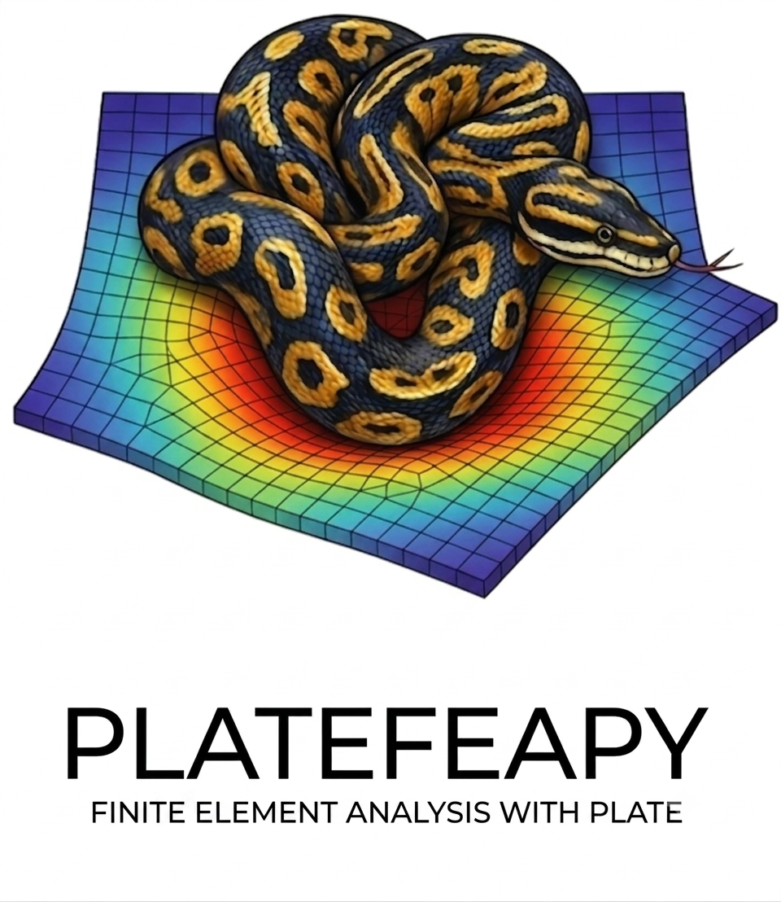

# platefeapy

<div align="center">
  
</div>

A Python finite-element solver for the **static and modal analysis** of **plate structures** using Mindlin-Reissner and Kirchhoff-Love theory — including pressure loads, thermal gradients, settlements, modal analysis, and Plotly visualization.

## Documentation

- **Site:** <https://domenicogaudioso.github.io/platefeapy/>

## Features

- **Mindlin-Reissner plate** (thick plates, shear deformable, SRI integration to avoid shear locking)
- **Kirchhoff-Love plate** (thin plates, ACM element — Adini-Clough-Melosh)
- **Pressure loads** (uniform and patch)
- **Nodal loads** (forces and moments)
- **Thermal loads** (gradient through thickness)
- **Nodal settlements** (imposed displacements/rotations)
- **Modal analysis** (natural frequencies, periods, mode shapes)
- **Post-processing**: bending moments (Mx, My, Mxy), shear forces (Qx, Qy), displacements
- **Plotly plots**: mesh, deformed shape, contour maps, reactions, mode shapes
- **Load cases**: assign loads to cases; solve combinations with coefficients

## Installation

```bash
pip install -e ".[all]"
```

**Requirements:** Python >= 3.9, numpy >= 1.24, scipy >= 1.10

## Quick Start

```python
from platefeapy import Model, Material, ShellSection

m = Model()
m.add_node(1, 0, 0)
m.add_node(2, 1, 0)
m.add_node(3, 1, 1)
m.add_node(4, 0, 1)

mat = Material(E=210e9, nu=0.3)
sec = ShellSection(t=0.01)
m.add_plate(1, [1, 2, 3, 4], mat, sec)

for nid in range(1, 5):
    m.fix(nid, ["w"])

m.add_pressure(1, p=-1000.0)
res = m.solve()
print(res.displacements(1))  # [w, theta_x, theta_y]
```

## API Reference

### Model Construction

| Method | Description |
|--------|-------------|
| `Model()` | Create an empty model |
| `m.add_node(id, x, y)` | Add a node with ID and coordinates |
| `m.add_plate(id, nodes, mat, sec, theory=...)` | Add a plate element (4 nodes) |

### Materials & Sections

```python
mat = Material(E=210e9, nu=0.3, alpha=1.2e-5)
sec = ShellSection(t=0.01, kappa=5/6)
```

### Supports

```python
m.fix(1)                              # fixed (all 3 DOFs)
m.pin(1)                              # simple support (w only)
m.support(1, w=True, theta_x=True)    # custom
```

### Loads

```python
m.add_nodal_load(node, Fz=..., Mx=..., My=..., case=...)
m.add_pressure(elem, p=..., case=...)
m.add_thermal_load(elem, dT=..., case=...)
m.add_settlement(node, dof, value)
```

### Solution

```python
res = m.solve()
res = m.solve(cases={"G": 1.35, "Q": 1.5})
res.displacements(node)    # [w, theta_x, theta_y]
res.reactions(node)         # [Fz, Mx, My]
```

### Post-processing

```python
from platefeapy import postprocess

di = postprocess.element_stresses(res, elem_id, n=5)
# Returns: x, y, Mx, My, Mxy, Qx, Qy

di = postprocess.element_displacements(res, elem_id, n=11)
# Returns: x, y, w

M1, M2, alpha = postprocess.principal_moments(Mx, My, Mxy)
```

### Plotting

```python
from platefeapy.plotting import (
    plot_mesh, plot_deformed, plot_contour,
    plot_reactions, plot_mode,
)

plot_mesh(m).show()
plot_deformed(res, scale=100).show()
plot_contour(res, "Mx").show()
```

## Conventions

- **Nodal DOFs**: `[w, theta_x, theta_y]` (transverse displacement, rotations about X and Y)
- **Plate plane**: X-Y global, thickness in Z direction
- **Moments**: Mx (bending about Y), My (bending about X), Mxy (twisting)
- **Shear forces**: Qx, Qy
- **Pressure**: positive towards +Z
- **Units**: user's choice (consistent, e.g. SI: N, m, Pa)

## Project Structure

```
platefeapy/
├── platefeapy/           # core library
│   ├── material.py       # Material (E, nu, alpha, G)
│   ├── section.py        # ShellSection (t, kappa)
│   ├── node.py           # Node (id, x, y)
│   ├── element.py        # MindlinPlateQ4, KirchhoffPlateQ4
│   ├── loads.py          # NodalLoad, PressureLoad, ThermalLoad, Settlement
│   ├── integration.py    # Gauss quadrature
│   ├── model.py          # Model: assembly, constraints, solution
│   ├── postprocess.py    # stresses, displacements
│   └── plotting/         # Plotly visualizations
├── examples/             # basic examples
├── tests/                # pytest tests
├── docs/                 # Jekyll documentation
└── pyproject.toml        # packaging
```

## Testing

```bash
pip install -e ".[dev]"
python -m pytest tests -q
```

## License

MIT — see `LICENSE`.
