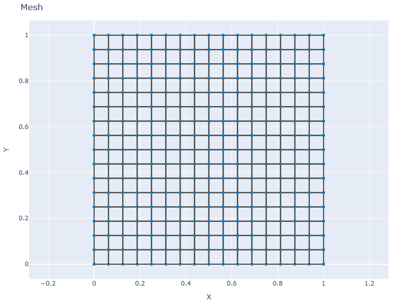
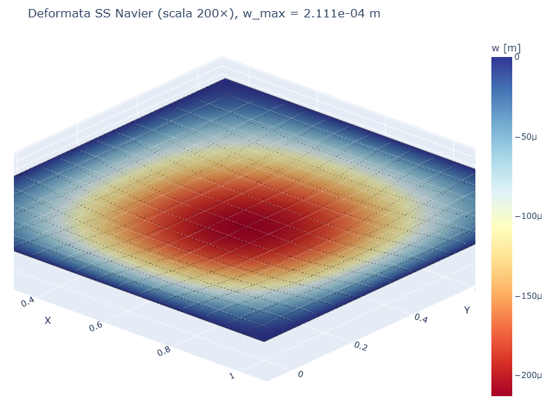
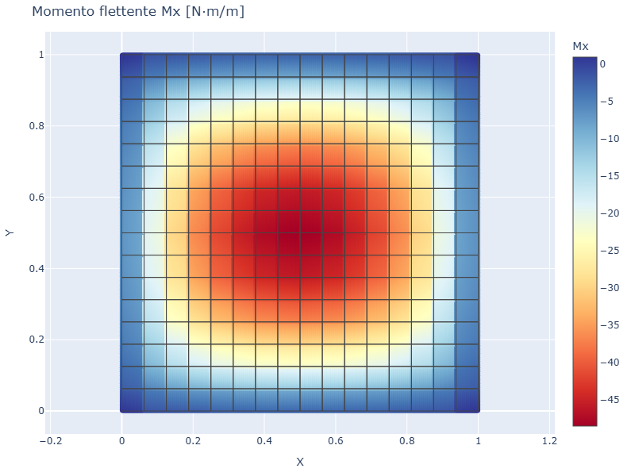
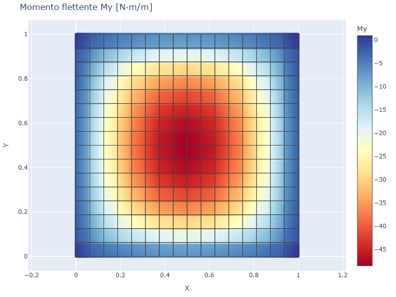
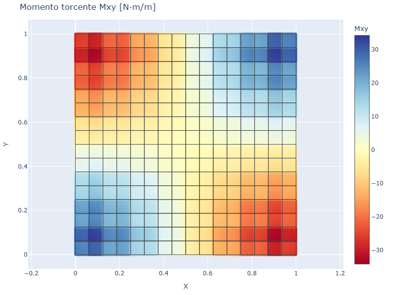

# CS01 — Piastra SS uniforme (Navier)

## Caso di letteratura

Piastra quadrata di lato `L = 1 m`, vincolata con **appoggio semplice** su
tutti e quattro i lati, soggetta a **pressione uniforme** `p = -1 kPa`.
E' il caso classico della soluzione in serie doppia di seni di
**Navier** (Timoshenko, *Theory of Plates and Shells*, Cap. 3, p. 197).

## Modello

Costruzione del modello in **platefeapy**:

```python
from platefeapy import Model, Material, ShellSection

m = Model()
mat = Material(E=210e9, nu=0.3)
sec = ShellSection(t=0.01)

# mesh 16x16 in [0,1] x [0,1]
n = 17
nid = 1
for j in range(n):
    for i in range(n):
        m.add_node(nid, i / 16.0, j / 16.0)
        nid += 1
eid = 1
for j in range(16):
    for i in range(16):
        n1 = j * 17 + i + 1
        m.add_plate(eid, [n1, n1+1, n1+18, n1+17], mat, sec)
        eid += 1

# vincoli SS (w=0) sui bordi
for j in range(n):
    for i in range(n):
        nid = j * 17 + i + 1
        if i in (0, 16) or j in (0, 16):
            m.fix(nid, ["w"])

# pressione uniforme su tutti gli elementi
for eid in m.elements:
    m.add_pressure(eid, p=-1000.0)
```

## Mesh e deformata

| Mesh | Deformata (scala 200×) |
|------|------------------------|
|  |  |

## Soluzione di riferimento (Navier)

Al centro della piastra (`x = y = L/2`), la soluzione esatta in serie
fornisce:

$$
w_\max = 0{,}00406 \,\frac{p L^4}{D}, \quad D = \frac{E t^3}{12(1-\nu^2)}
$$

Con `L = 1 m`, `p = -1000 Pa`, `E = 210 GPa`, `nu = 0.3`, `t = 10 mm`:

- `D = 1.923e4 N·m`
- `w_max esatto = 2.111e-4 m`

## Convergenza FEM

| Mesh  | w_max FEM [m]  | err %  |
|-------|----------------|--------|
| 4×4   | 2.250e-4       | 6.60%  |
| 8×8   | 2.150e-4       | 1.85%  |
| 12×12 | 2.134e-4       | 1.08%  |
| 16×16 | 2.131e-4       | 0.92%  |
| 20×20 | 2.130e-4       | 0.90%  |

A convergenza, l'errore residuo e' legato alla formulazione Q4 Mindlin
(integrazione ridotta selettiva): circa l'1% rispetto alla soluzione
asintotica esatta in forma di serie infinita.

## Momenti flettenti e tagli

| Mx [N·m/m] | My [N·m/m] | Mxy [N·m/m] |
|------------|------------|-------------|
|  |  |  |

I momenti flettenti `Mx` e `My` mostrano la tipica doppia sinusoidalita'
della soluzione Navier, con massimi positivi al centro di ciascun quarto
di piastra. Il momento torcente `Mxy` si annulla sugli assi di simmetria
e ha i massimi ai quarti della diagonale.

## Script

`casestudies/cs01_ss_navier.py`
