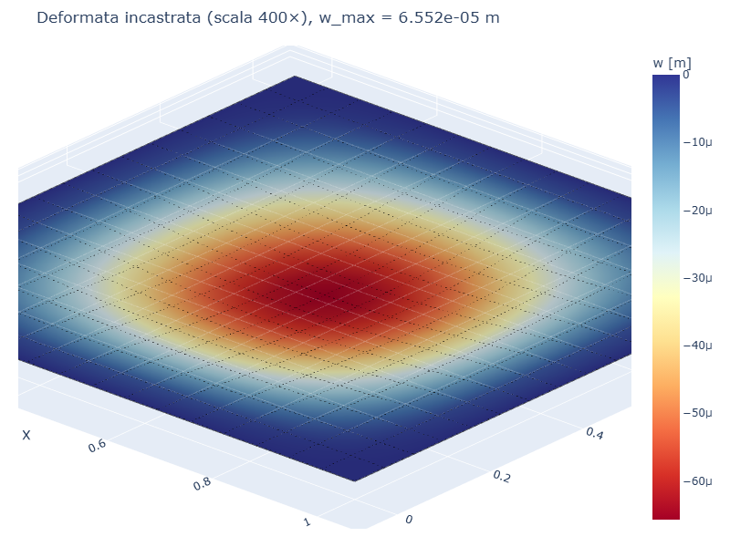
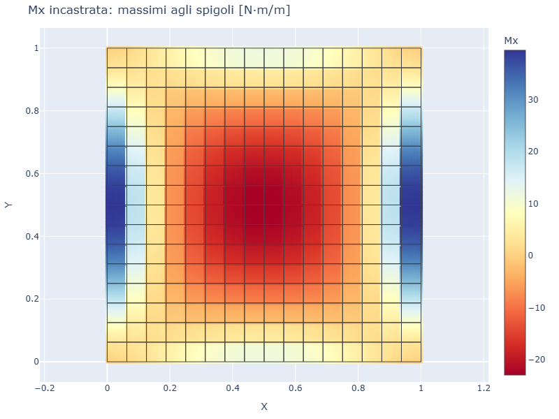
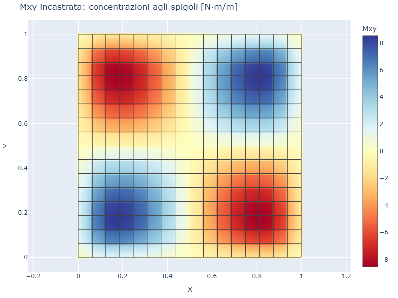
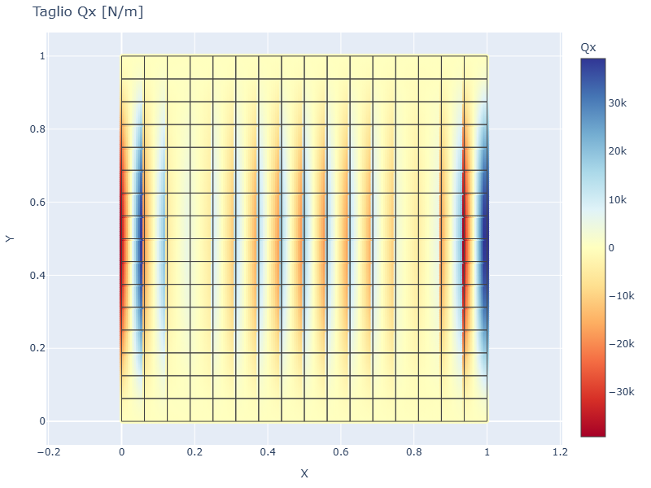

# CS02 — Piastra incastrata uniforme (Timoshenko)

## Caso di letteratura

Piastra quadrata di lato `L = 1 m`, **incastrata** su tutti e quattro i
lati (`w = theta_x = theta_y = 0` sul bordo), soggetta a pressione
uniforme `p = -1 kPa`. Soluzione in forma di doppia serie
(Timoshenko & Woinowsky-Krieger, *Theory of Plates and Shells*,
2 ed., Cap. 3, p. 197).

## Modello

Costruzione del modello in **platefeapy**:

```python
m = Model()
mat = Material(E=210e9, nu=0.3)
sec = ShellSection(t=0.01)
# ... mesh 16x16 come CS01 ...
# vincoli incastrati (tutti i 3 GdL)
for nid on border:
    m.fix(nid)
# pressione uniforme
for eid in m.elements:
    m.add_pressure(eid, p=-1000.0)
```

## Mesh e deformata

| Mesh | Deformata (scala 400×) |
|------|------------------------|
|  |  |

La deformata e' tipica: tre "lobi" di curvatura con punti di flesso
interni. L'incastro genera forti momenti flettenti negativi (di
controsollevamento) lungo i bordi.

## Soluzione di riferimento

$$
w_\max = 0{,}00126 \,\frac{p L^4}{D}
$$

`w_max esatto = 6.552e-5 m`.

## Convergenza FEM

| Mesh  | w_max FEM [m]  | err % |
|-------|----------------|-------|
| 4×4   | 6.312e-5       | 3.66% |
| 8×8   | 6.517e-5       | 0.53% |
| 12×12 | 6.559e-5       | 0.11% |
| 16×16 | 6.574e-5       | 0.33% |
| 20×20 | 6.581e-5       | 0.44% |

## Momenti flettenti, torcente e tagli

| Mx | Mxy | Qx |
|----|-----|-----|
|  |  |  |

`Mx` mostra la classica distribuzione con massimi negativi lungo i bordi
incastrati. `Mxy` ha concentrazioni elevate agli spigoli (singolarita'
di Kirchhoff). `Qx` e' lineare lungo la direzione y per la simmetria del
problema.

## Script

`casestudies/cs02_clamped.py`
