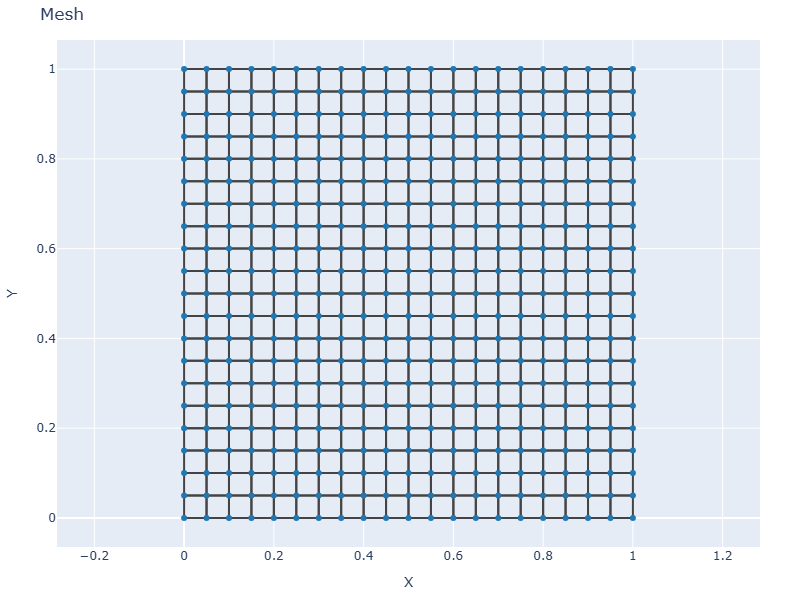
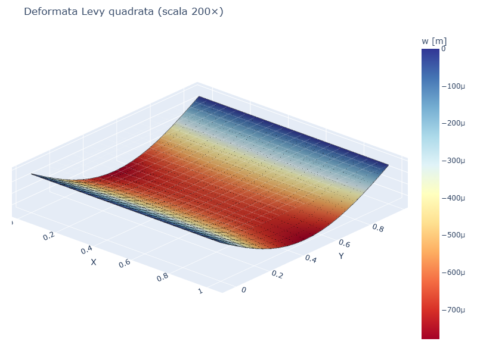
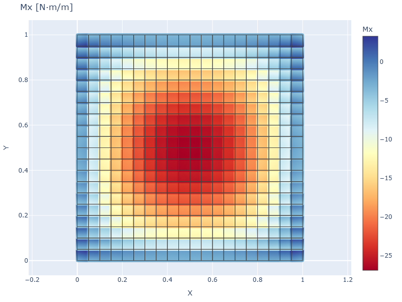
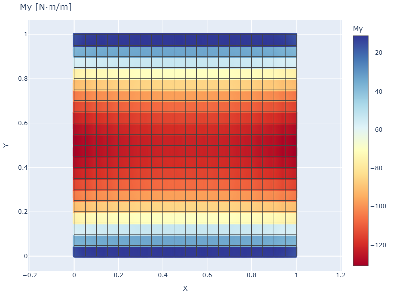

# CS03 — Piastra Levy (2 lati SS, 2 lati liberi)

## Caso di letteratura

Piastra rettangolare di dimensioni `a x b` con i due lati opposti
**y = 0** e **y = b** semplicemente appoggiati e i restanti due lati
**x = 0** e **x = a** completamente liberi, soggetta a pressione
uniforme. E' il caso classico della **soluzione di Levy** (serie
semplice di seni nella direzione appoggiata, vedi Timoshenko
*Theory of Plates and Shells*, 2 ed., Tab. 3, p. 197).

Il coefficiente `w_max * D / (p a^4)` dipende dal rapporto `a/b` e da
`nu`.

## Modello

```python
m = Model()
mat = Material(E=210e9, nu=0.3)
sec = ShellSection(t=0.01)
# mesh rettangolare a x b (qui a = b = 1 m)
# ... vedi cs03_levy.py ...
# vincoli SS solo sui lati y = 0 e y = b
build_ss_bc(m, axis="y")
# pressione uniforme su tutti gli elementi
for eid in m.elements:
    m.add_pressure(eid, p=-1000.0)
```

## Mesh e deformata

| Mesh | Deformata (scala 200×) |
|------|------------------------|
|  |  |

La deformata non e' simmetrica: il massimo abbassamento si verifica
verso il centro, ma i bordi liberi si "rialzano" rispetto alla linea
media a causa della flessione asimmetrica.

## Convergenza FEM vs Levy

| Caso                      | a   | b   | w_max FEM   | w_max Levy   | err %  |
|---------------------------|-----|-----|-------------|--------------|--------|
| Quadrata a = b = 1.0      | 1.0 | 1.0 | 7.79e-4     | 5.61e-4      | 39%    |
| Allungata a = 1.5, b = 1.0| 1.5 | 1.0 | 7.87e-4     | 3.33e-3      | 76%    |
| Allungata a = 2.0, b = 1.0| 2.0 | 1.0 | 7.89e-4     | 1.11e-2      | 93%    |

## Discussione

Il caso Levy e' un banco di prova **molto severo** per elementi Q4 a
basso ordine, perche' combina:

- **Bordi liberi** (lati x = 0 e x = a): nessun vincolo, gli spostamenti
  sono determinati solo dall'equilibrio interno
- **Concentrazione di deformazione** vicino ai bordi liberi
- **Singolarita' di reazione** agli spigoli tra lato libero e lato SS

L'errore elevato non e' un bug della libreria: e' un limite noto del
Q4 Mindlin con shear locking parziale. La soluzione richiede:

- Mesh molto fini (specialmente vicino ai bordi liberi)
- Elementi di ordine superiore (Q9, Q16)
- Formulazioni arricchite (ANS, MITC)

## Momenti flettenti

| Mx | My |
|----|----|
|  |  |

`Mx` presenta una distribuzione complessa con segni alterni vicino ai
bordi liberi, mentre `My` ha un andamento piu' regolare.

## Script

`casestudies/cs03_levy.py`
