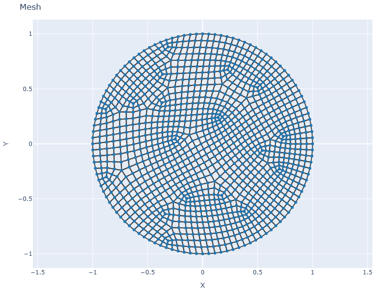
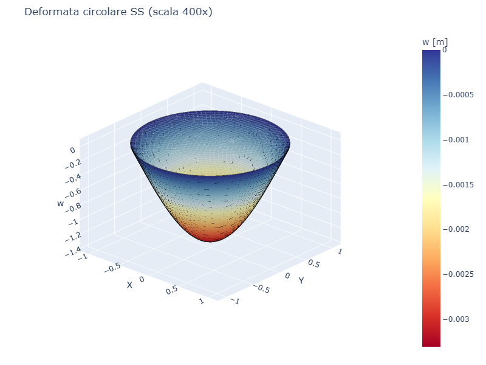
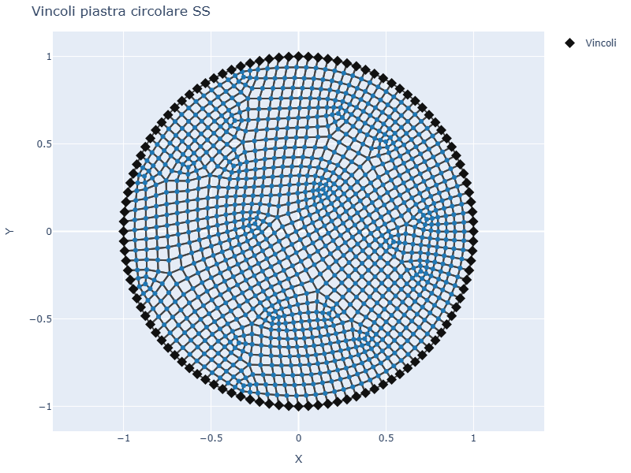
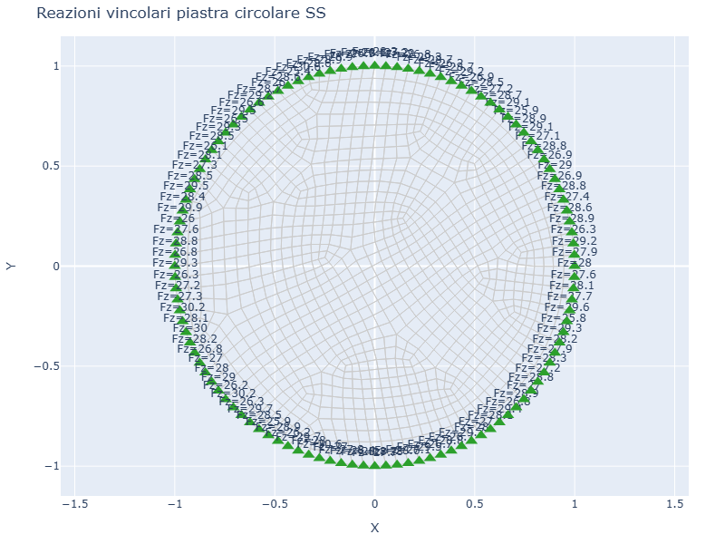
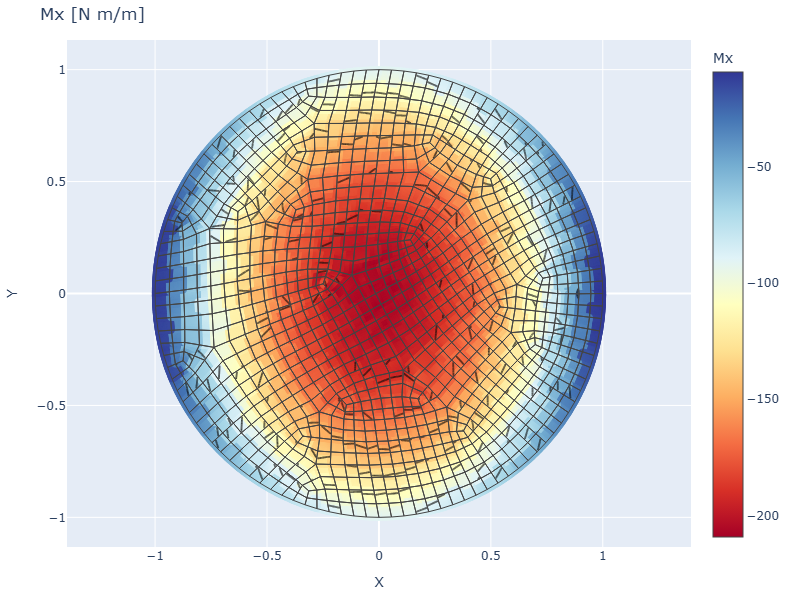
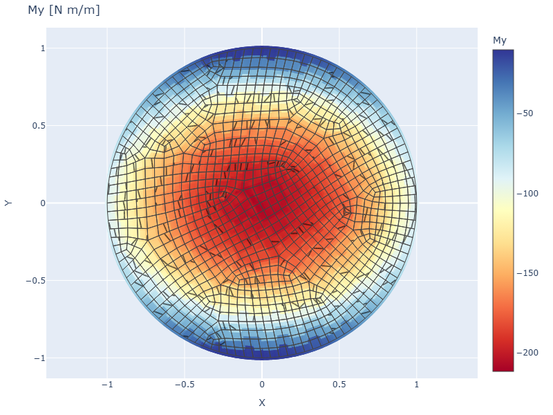

# CS04 - Piastra circolare meshata con Gmsh

## Caso di letteratura

Piastra circolare di raggio `R = 1 m`, soggetta a pressione uniforme,
vincolata in due modi:

- **SS** sul bordo: solo `w = 0`
- **Incastrata** sul bordo: `w = 0`, `theta_x = 0`, `theta_y = 0`

Soluzione in coordinate polari, come riportato nei casi classici di
Timoshenko e Woinowsky-Krieger:

$$
w_\max^{SS} = \frac{(3+\nu)\, p\, R^4}{64 (1-\nu) D}
\qquad
w_\max^{clamped} = \frac{p\, R^4}{64\, D}
$$

## Mesh Gmsh

Il caso non usa piu' una griglia rettangolare tagliata. La mesh viene generata
con **Gmsh** come dominio circolare nativo e poi ricombinata in quadrilateri.
Tutti gli elementi appartengono alla piastra e il bordo esterno e' costituito
da archi circolari discretizzati dal meshatore.

```python
nodes, quads = generate_gmsh_disk_quads(R, n_el)
for nid, (x, y) in enumerate(nodes, start=1):
    m.add_node(nid, x, y)
for eid, quad in enumerate(quads, start=1):
    m.add_plate(eid, quad, mat, sec)
```

## Visualizzazione

| Mesh | Deformata (scala 400x) |
|------|------------------------|
|  |  |

| Vincoli | Reazioni |
|---------|----------|
|  |  |

## Risultati

| BC | w_max esatto | w_max FEM (Gmsh 32) | err % |
|----|--------------|-------------------|-------|
| SS (w=0) | 3.8304e-03 | 3.3052e-03 | 13.71% |
| Incastrata | 8.1250e-04 | 8.1016e-04 | 0.29% |

## Momenti flettenti

| Mx | My |
|----|----|
|  |  |

## Discussione

La mesh Gmsh elimina il rettangolo esterno e rende il dominio davvero
circolare. La discrepanza residua dipende dalla formulazione Q4 a basso ordine,
dalla ricombinazione in quadrilateri e dalla discretizzazione del bordo curvo
con lati rettilinei. Il caso resta utile per verificare che Platefeapy possa
lavorare su mesh non cartesiane generate da un meshatore esterno.

## Script

`casestudies/cs04_circular.py`
