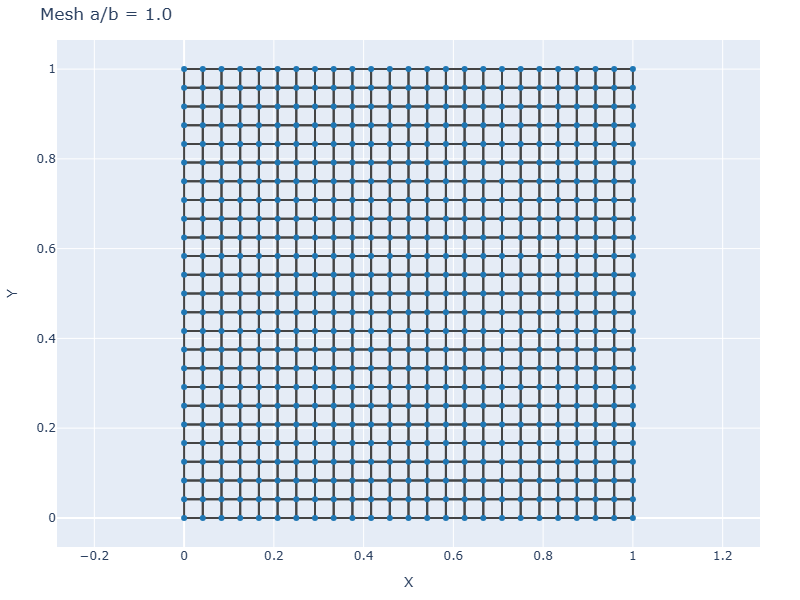
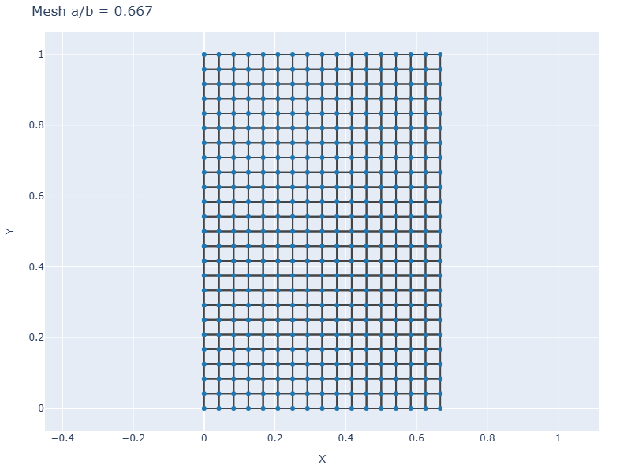
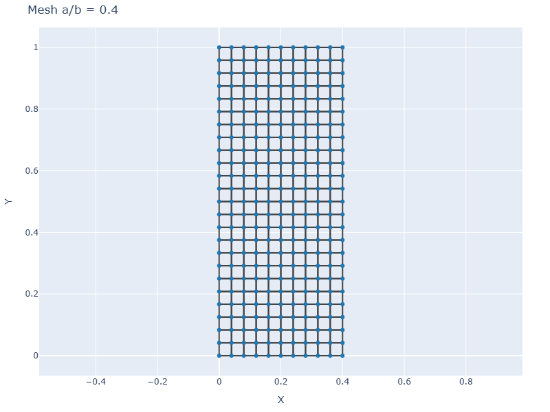
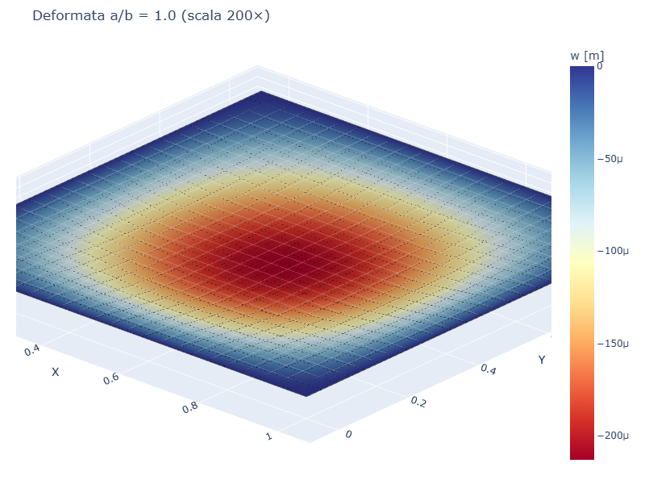
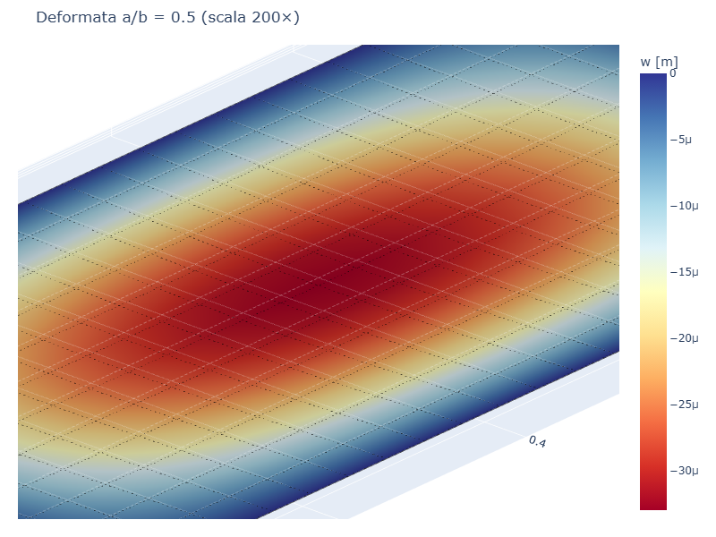
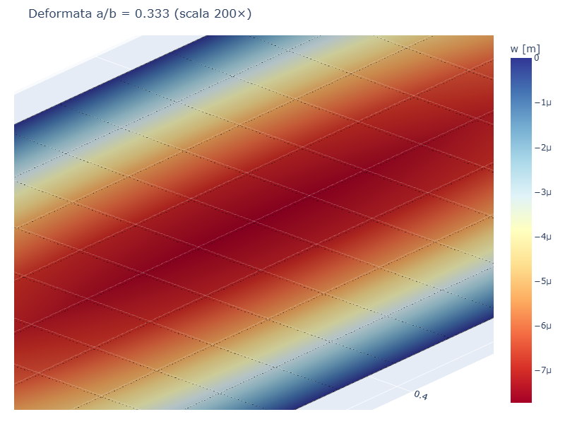

# CS05 — Piastra rettangolare: influenza del rapporto lati

## Caso di letteratura

Piastra rettangolare `a x b` con **a <= b** (a lato corto), SS su tutti e
quattro i lati, soggetta a pressione uniforme. Si varia il rapporto
`a/b` mantenendo fisso il lato lungo `b = 1 m`.

Soluzione esatta (Timoshenko, *Theory of Plates and Shells*, 2 ed.,
Tab. 2, p. 196) in funzione del rapporto `a/b` e di `nu`:

$$
w_\max = \alpha(a/b, \nu) \,\frac{p a^4}{D}
$$

## Modello

```python
m = Model()
mat = Material(E=210e9, nu=0.3)
sec = ShellSection(t=0.01)
# mesh rettangolare a x b
rect_plate_mesh(m, a, b, n_ex, n_ey, mat, sec)
build_ss_bc(m, axis="all")
for eid in m.elements:
    m.add_pressure(eid, p=-1000.0)
```

## Mesh per diversi aspect ratio

| a/b = 1.0 | a/b = 0.667 | a/b = 0.4 |
|-----------|-------------|-----------|
|  |  |  |

## Deformate

| a/b = 1.0 | a/b = 0.5 | a/b = 0.333 |
|-----------|-----------|-------------|
|  |  |  |

Al tendere di `a/b -> 0` (striscia molto lunga), la piastra si comporta
come una trave semplicemente appoggiata di luce `a`: la deformata ha un
solo lobo di curvatura.

## Convergenza FEM

| a/b  | a    | mesh        | w_max FEM   | w_max esatto | err % |
|------|------|-------------|-------------|--------------|-------|
| 1.0  | 1.0  | 24×24       | 2.13e-4     | 2.11e-4      | 0.92% |
| 0.8  | 0.8  | 20×24       | 1.34e-4     | 1.32e-4      | 1.51% |
| 0.667| 0.667| 16×24       | 8.51e-5     | 8.49e-5      | 0.27% |
| 0.5  | 0.5  | 12×24       | 3.30e-5     | 3.29e-5      | 0.30% |
| 0.4  | 0.4  | 10×24       | 1.53e-5     | 1.59e-5      | 4.16% |
| 0.333| 0.333| 8×24        | 7.72e-6     | 8.54e-6      | 9.52% |

## Discussione

- L'errore cresce al diminuire di `a/b`: per `a/b = 0.333` la mesh
  trasversale (8 elementi) non e' sufficiente a catturare l'andamento
  sinusoidale doppio
- Per `a/b = 1` (quadrata) l'errore e' minimo
- Per `a/b = 0.5` l'errore e' < 1%
- Per `a/b < 0.4` e' necessario raffinare la mesh trasversale

## Script

`casestudies/cs05_rectangular_aspect.py`
