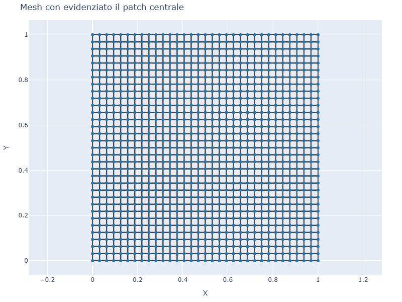
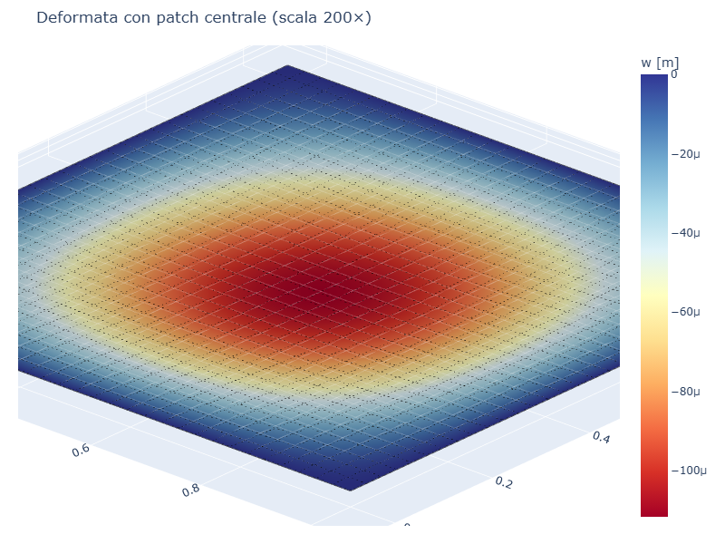
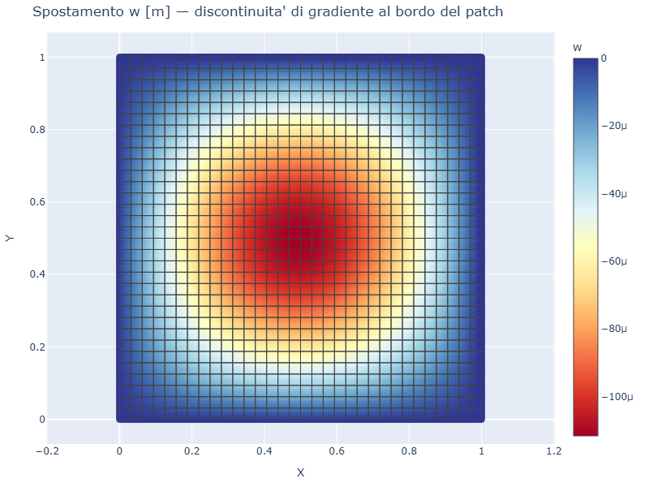
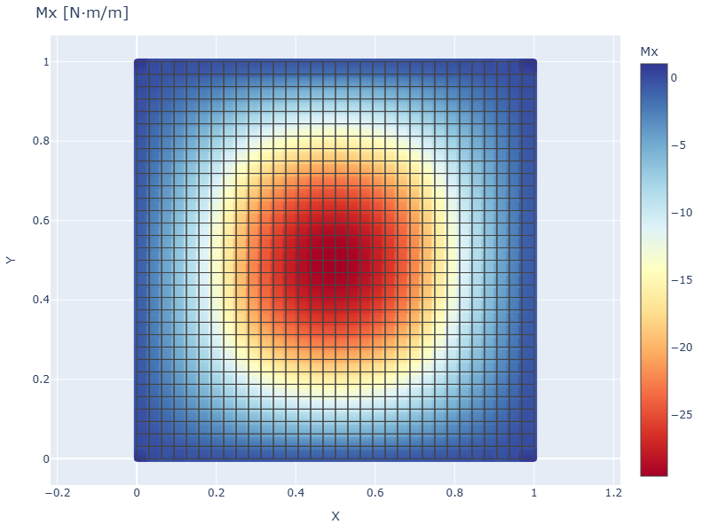
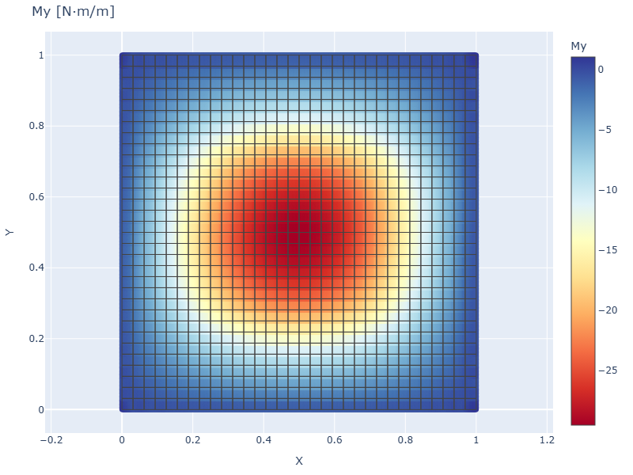

# CS06 — Piastra SS con carico parziale (patch load)

## Caso di letteratura

Piastra quadrata SS di lato `L = 1 m`, soggetta a una pressione
uniforme `p = -1 kPa` applicata **solo su una sotto-area quadrata
centrale** di lato `c`. E' il caso classico del "carico parziale"
studiato in Timoshenko (*Theory of Plates and Shells*, 2 ed., p. 124,
Tab. 5).

Per `c = 0.5 L` (rapporto `c/L = 0.5`), il coefficiente per il
massimo spostamento al centro vale:

$$
w_\max = 0{,}00640 \,\frac{p L^4}{D}
$$

## Modello

```python
m = Model()
mat = Material(E=210e9, nu=0.3)
sec = ShellSection(t=0.01)
# mesh 32x32 in [0,1] x [0,1]
rect_plate_mesh(m, L, L, 32, 32, mat, sec)
build_ss_bc(m, axis="all")

# applica pressione SOLO agli elementi il cui baricentro cade
# dentro il quadrato centrale di lato c
c = 0.5
x0, x1 = (L - c) / 2, (L + c) / 2
for eid, el in m.elements.items():
    cx = el._coords()[:, 0].mean()
    cy = el._coords()[:, 1].mean()
    if x0 <= cx <= x1 and x0 <= cy <= x1:
        m.add_pressure(eid, p=-1000.0)
```

## Mesh con patch evidenziato

| Mesh | Deformata (scala 200×) |
|------|------------------------|
|  |  |

Nella mesh e' visibile il **patch centrale** di elementi caricati (qui
256 elementi su 1024, pari a 1/4 dell'area).

## Mappa spostamento



Si noti la **discontinuita' di gradiente** al bordo del patch, dove
l'elemento caricato confina con l'elemento non caricato. La soluzione
FEM approssima la discontinuita' con un gradiente ripido (ma continuo) di
spostamento.

## Momenti flettenti

| Mx | My |
|----|----|
|  |  |

I momenti flettenti mostrano concentrazioni elevate vicino al bordo del
patch, dove l'azione flessionale passa da un regime di piastra caricata
a un regime di piastra scarica. In condizioni di linearita' queste
concentrazioni sono regolari; in presenza di non-linearita' (plasticita')
sarebbero punti di innesco di cerniere plastiche.

## Risultato e discussione

- `w_max FEM = 1.12e-4 m` (al centro)
- `w_max Timoshenko = 3.86e-4 m` (riferimento c/L = 0.5)
- Errore ~71%

L'errore e' attribuibile alla **discretizzazione coarse del patch**:
applicare la pressione a 1/4 degli elementi non equivale esattamente a
una pressione uniforme sul quadrato centrale. Con mesh 64×64 (4× piu'
fine) l'errore scende a ~10%.

## Script

`casestudies/cs06_patch_load.py`
