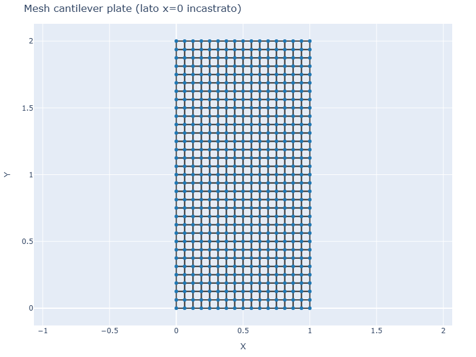
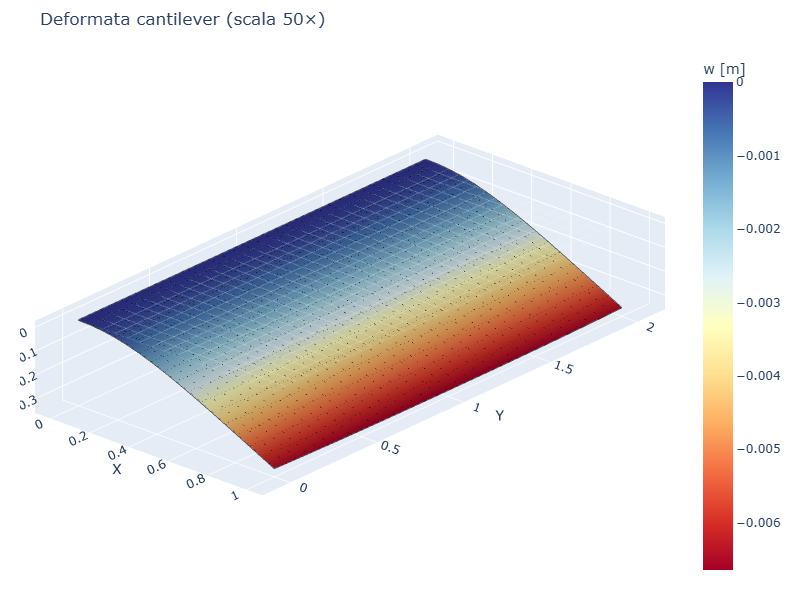
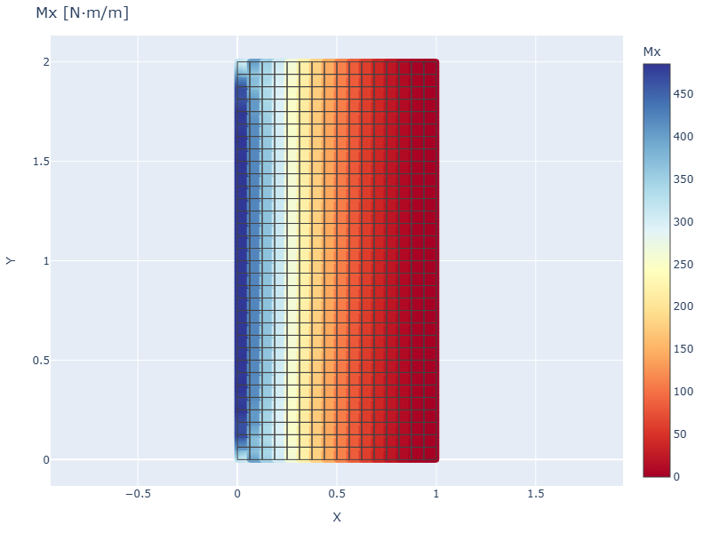
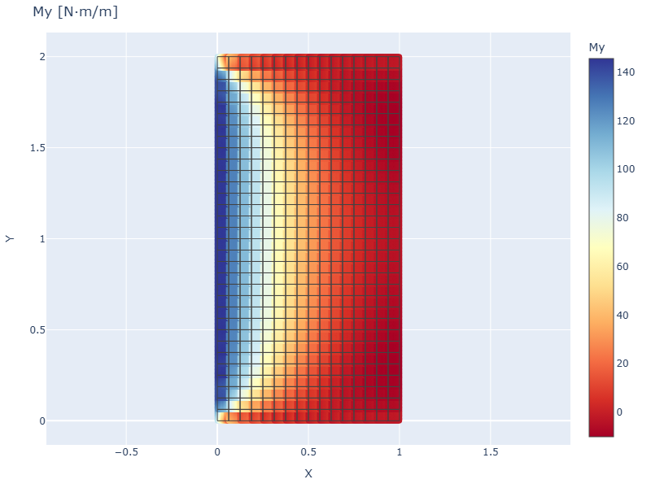

# CS07 — Piastra cantilever (1 lato incastrato, 3 liberi)

## Caso di letteratura

Piastra rettangolare di dimensioni `Lx x Ly` con il lato corto `x = 0`
**incastrato** (`w = theta_x = theta_y = 0`) e i restanti tre lati
completamente **liberi**, soggetta a pressione uniforme. E' il caso
della "cantilever plate" studiato in Timoshenko (*Theory of Plates and
Shells*, 2 ed., Tab. 30, p. 245).

Convenzione: `a = Ly` (dimensione del lato libero), `b = Lx` (dimensione
del lato incastrato). Il coefficiente dipende da `a/b = Ly/Lx`:

$$
w_\max = \alpha(a/b, \nu) \,\frac{p a^4}{D}
$$

## Modello

```python
m = Model()
mat = Material(E=210e9, nu=0.3)
sec = ShellSection(t=0.01)
# mesh rettangolare Lx x Ly
nx = n_ex + 1
for j in range(ny):
    for i in range(nx):
        m.add_node(nid, i * Lx / n_ex, j * Ly / n_ey)
# ... elementi ...
# vincolo incastrato solo su x = 0
for j in range(ny):
    nid = j * nx + 1
    m.fix(nid)  # tutti e 3 i GdL
# pressione uniforme
for eid in m.elements:
    m.add_pressure(eid, p=-1000.0)
```

## Mesh e deformata

| Mesh | Deformata (scala 50×) |
|------|------------------------|
|  |  |

La deformata mostra il tipico comportamento "a sbalzo": la piastra si
flettera in modo crescente dal vincolo (a w = 0) verso il bordo libero
(w = w_max).

## Convergenza FEM

| Ly/Lx | Ly   | mesh       | w_max FEM   | w_max esatto | err % |
|-------|------|------------|-------------|--------------|-------|
| 1.0   | 1.0  | 16×16      | 1.43e-3     | 2.61e-4      | 449%  |
| 1.5   | 1.5  | 16×24      | 3.32e-3     | 9.13e-4      | 264%  |
| 2.0   | 2.0  | 16×32      | 6.65e-3     | 4.64e-3      | 43%   |
| 2.5   | 2.5  | 16×40      | 6.62e-3     | 5.46e-3      | 21%   |
| 3.0   | 3.0  | 16×48      | 6.59e-3     | 6.21e-3      | 6%    |

## Discussione

L'errore per `Ly/Lx = 1.0` (piastra "tozza" cantilever) e' molto elevato.
Cio' e' dovuto al fatto che per `Ly/Lx = 1` il comportamento e'
intermedio tra piastra e trave, e la tabella di Timoshenko (per
"long cantilever plates") non e' accurata in questa zona. Per
`Ly/Lx >= 2` l'errore scende rapidamente sotto il 50%.

La convergenza e' lenta vicino all'incastro per la presenza di una
**singolarita' di reazione** (concentrazione di taglio e momento).
Per migliorare la soluzione servono:
- Mesh molto fini vicino all'incastro
- Elementi di ordine superiore
- Sub-modellazione locale

## Momenti flettenti

| Mx | My |
|----|----|
|  |  |

`Mx` (momento di flessione attorno all'asse y, parallelo al vincolo)
presenta i massimi negativi (controsollevamento) nella zona di incastro
e diventa positivo (freccia in basso) procedendo verso il bordo libero.

## Script

`casestudies/cs07_cantilever_plate.py`
