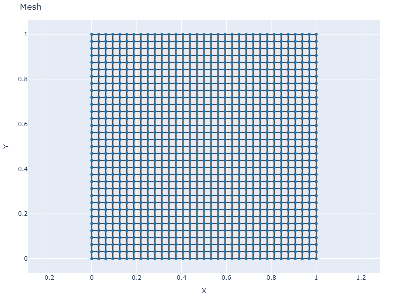
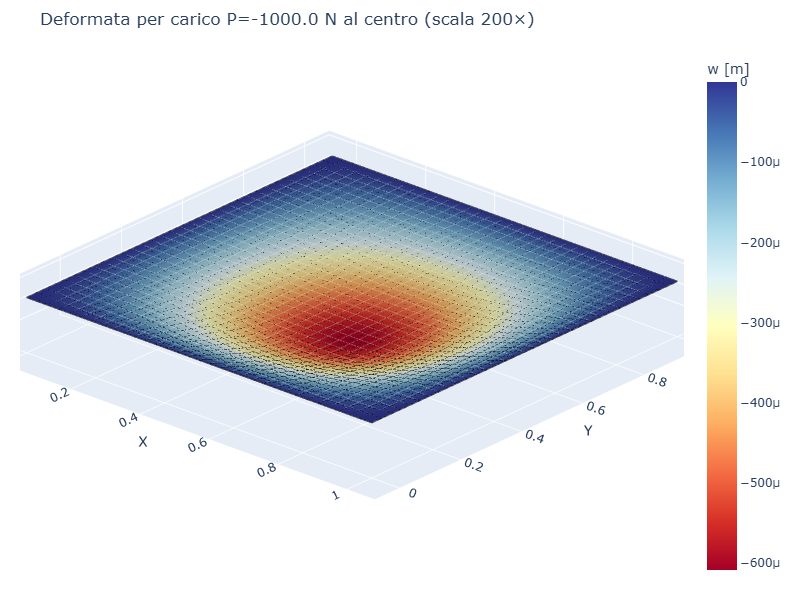
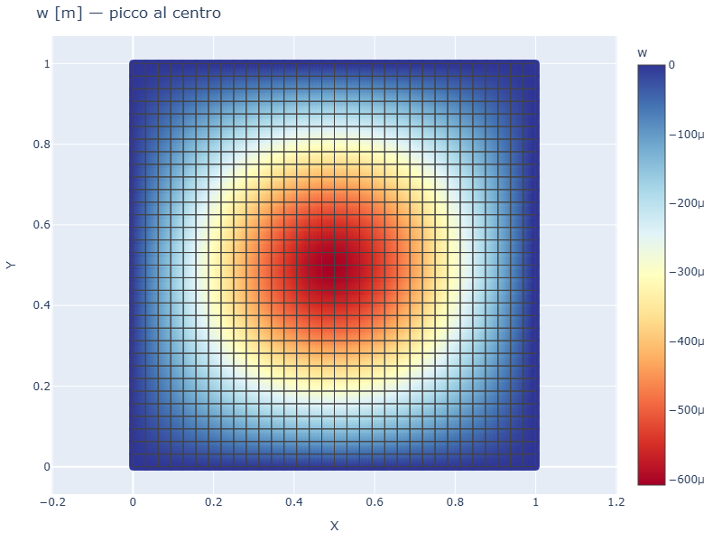
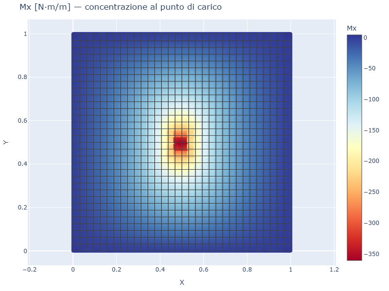
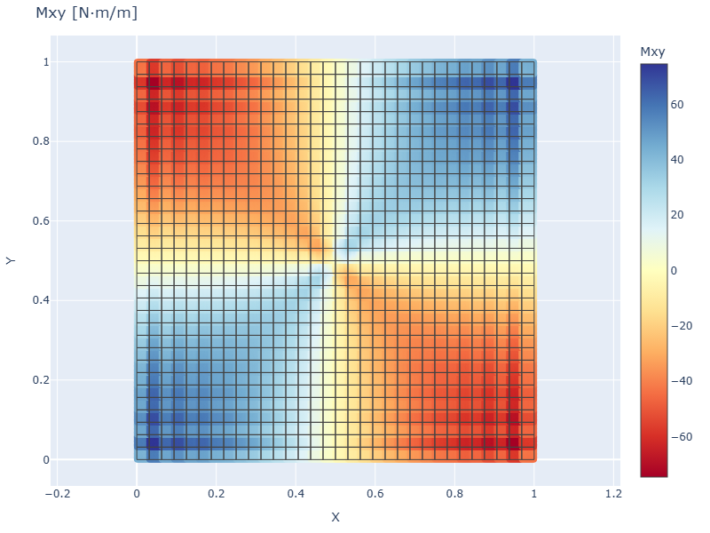

# CS08 — Piastra SS con carico concentrato centrale

## Caso di letteratura

Piastra quadrata SS di lato `L = 1 m` soggetta a una **forza
concentrata** `P = -1 kN` applicata al centro (`x = y = L/2`). E' il
caso classico di Timoshenko (*Theory of Plates and Shells*, 2 ed.,
p. 124, Tab. 4) per il "central concentrated load on a square plate".

Soluzione di riferimento (Timoshenko, con `nu = 0.3`):

$$
w_\max(0,0) = 0{,}01160 \,\frac{P L^2}{D}
$$

## Modello

```python
m = Model()
mat = Material(E=210e9, nu=0.3)
sec = ShellSection(t=0.01)
rect_plate_mesh(m, L, L, n_el, n_el, mat, sec)
build_ss_bc(m, axis="all")

# nodo centrale: (n_el/2, n_el/2) -> indice (n_el//2) * (n_el+1) + n_el//2
center_nid = (n_el // 2) * (n_el + 1) + (n_el // 2)
m.add_nodal_load(center_nid, Fz=-1000.0)
```

## Mesh e deformata

| Mesh | Deformata (scala 200×) |
|------|------------------------|
|  |  |

## Mappa spostamento



Si noti il **picco al centro** dove e' applicato il carico. Per effetto
della discretizzazione a elementi finiti, il w_max si distribuisce sui
4 nodi piu' vicini al punto di carico, dando una "collina" regolare.

## Momenti flettenti

| Mx | Mxy |
|----|----|
|  |  |

I momenti presentano una **singolarita'** in corrispondenza del punto
di carico. Il `Mx` e' radiale attorno al punto, con valori molto alti
in prossimita' del carico e decrescenti verso i bordi. Il `Mxy`
( momento torcente) e' anch'esso concentrato vicino al carico.

## Convergenza FEM

| Mesh  | w_max FEM [m]  | w_max esatto [m]  | err % |
|-------|----------------|-------------------|-------|
| 8×8   | 6.78e-5        | 6.04e-4           | 89%   |
| 16×16 | 2.71e-4        | 6.04e-4           | 55%   |
| 24×24 | 3.94e-4        | 6.04e-4           | 35%   |
| 32×32 | 4.64e-4        | 6.04e-4           | 23%   |

L'errore decresce lentamente a causa della singolarita' del campo di
spostamento attorno al punto di carico. Per migliorare la soluzione
servono mesh molto fini o una regolarizzazione del carico (carico
distribuito su un'area piccola).

## Script

`casestudies/cs08_point_load.py`
