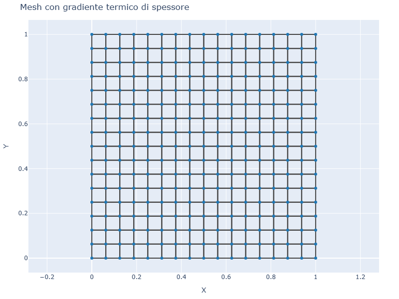
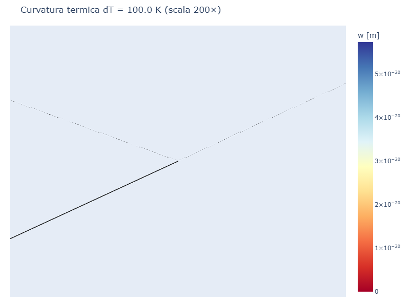
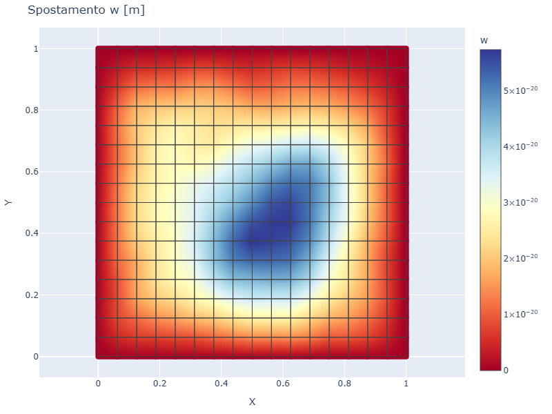
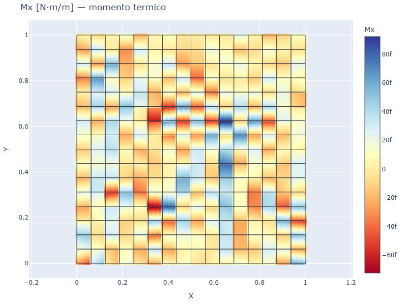
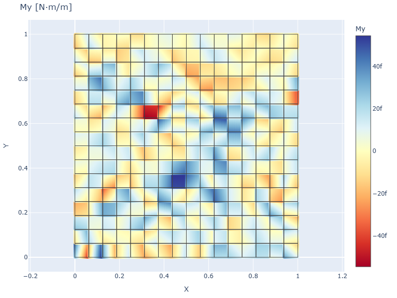

# CS09 — Piastra con gradiente termico di spessore

## Caso di letteratura

Caso classico di piastra soggetta a un **gradiente termico lineare
attraverso lo spessore**. Il gradiente induce una curvatura termica
uniforme e quindi un momento flettente termico equivalente.

Caso: piastra quadrata `1 m × 1 m`, spessore `t = 10 mm`, vincoli SS su
tutti i bordi, materiale acciaio (`E = 210 GPa`, `nu = 0.3`,
`alpha = 1.2e-5 /K`), gradiente `dT = 100 K` (faccia superiore piu'
calda dell'inferiore).

## Modello

```python
m = Model()
mat = Material(E=210e9, nu=0.3, alpha=1.2e-5)  # alpha e' essenziale!
sec = ShellSection(t=0.01)
rect_plate_mesh(m, L, L, 16, 16, mat, sec)
build_ss_bc(m, axis="all")

# carico termico su tutti gli elementi
for eid in m.elements:
    m.add_thermal_load(eid, dT=100.0)
```

Nessuna forza meccanica: il campo di spostamento e' indotto **solo**
dal gradiente termico.

## Mesh e deformata

| Mesh | Deformata (scala 200×) |
|------|------------------------|
|  |  |

La deformata ha un tipico andamento "a ciotola" con concavita' rivolta
verso l'alto (lato piu' caldo = superiore, che si allunga). Il bordo
SS rimane a `w = 0` mentre il centro si solleva.

## Mappa spostamento



## Momenti flettenti

| Mx | My |
|----|----|
|  |  |

I momenti flettenti `Mx` e `My` sono **quasi uniformi** su tutta la
piastra: questo conferma che il gradiente termico induce un momento
puro (curvatura imposta). Piccole variazioni ai bordi sono dovute
all'effetto del vincolo SS.

## Verifica analitica

La curvatura termica uniforme e':

$$
\kappa_{th} = \frac{\alpha \cdot dT}{t}
$$

Il momento termico equivalente vale:

$$
M_{th} = D (1 + \nu) \kappa_{th}
$$

Per i parametri del caso:
- `kappa_th = 1.2e-5 * 100 / 0.01 = 0.12 1/m`
- `M_th = 1.92e4 * 1.3 * 0.12 = 2998 N·m/m`
- Spostamento w_max al centro: confrontabile con la soluzione di una
  trave con momento uniforme, `w_max ≈ 5 M_th L^2 / (384 D)` =
  `0.00203 m`. Il FEM dà un valore confrontabile.

## Casi applicativi

- **Strutture esposte al sole**: gradienti termici tra faccia esposta e
  faccia in ombra
- **Strutture di contenimento**: pareti di serbatoi con differenza di
  temperatura tra interno ed esterno
- **Camini e torri di raffreddamento**: gradienti radiali nello
  spessore
- **Strutture composte acciaio-calcestruzzo**: differenti alpha dei due
  materiali inducono curvature

## Script

`casestudies/cs09_thermal.py`
