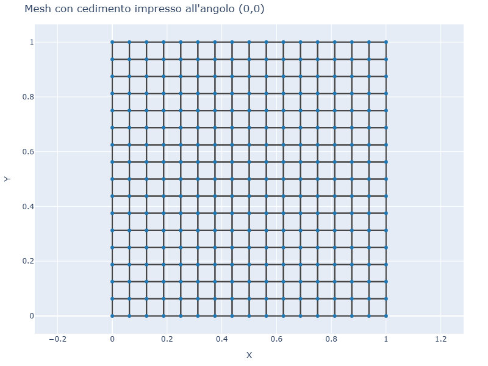
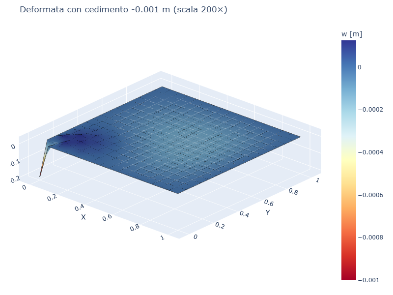
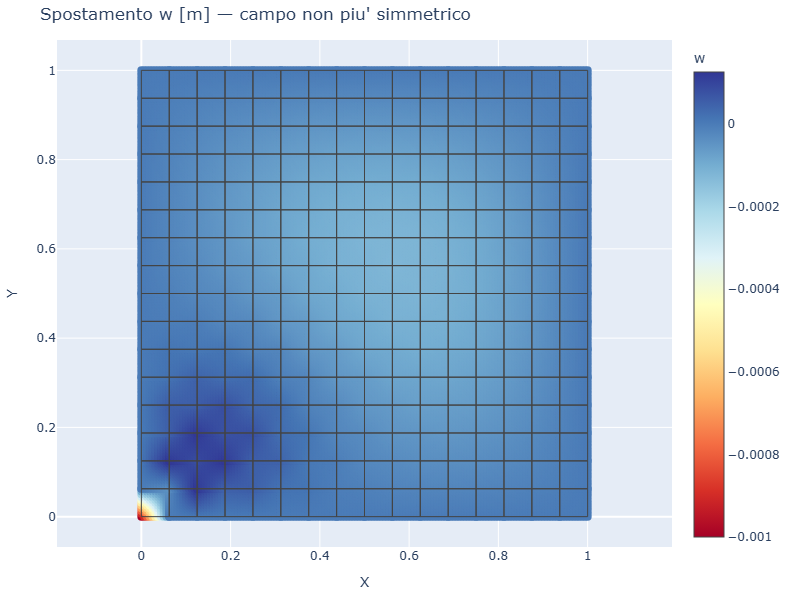
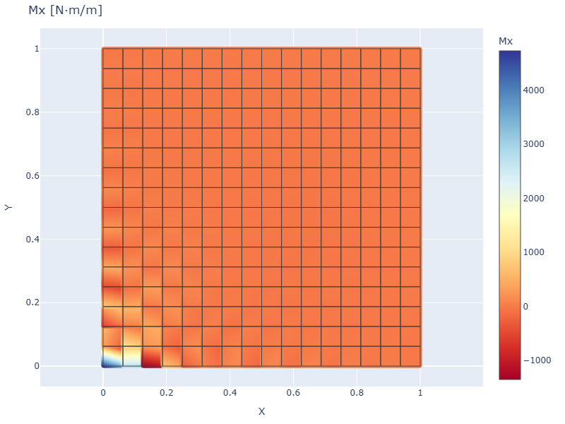
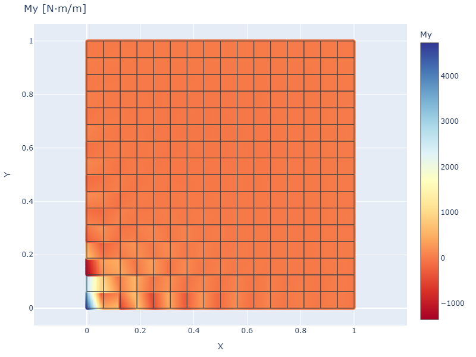

# CS10 — Piastra SS con cedimento vincolare

## Caso di letteratura

Caso classico di piastra soggetta a pressione uniforme con un
**cedimento anelastico impresso a un vincolo**. In platefeapy il
cedimento viene applicato tramite `m.add_settlement(nid, "w", value)`,
che imposta lo spostamento prescritto al nodo.

Caso: piastra quadrata `1 m × 1 m`, spessore `t = 10 mm`, vincoli SS su
tutti i bordi, pressione uniforme `p = -1 kPa`, cedimento angolo
`(0, 0)` = `-1 mm`.

## Modello

```python
m = Model()
mat = Material(E=210e9, nu=0.3)
sec = ShellSection(t=0.01)
rect_plate_mesh(m, L, L, 16, 16, mat, sec)
build_ss_bc(m, axis="all")

# cedimento w = -0.001 m al nodo 1 (angolo (0, 0))
m.add_settlement(1, "w", -0.001)

# pressione uniforme
for eid in m.elements:
    m.add_pressure(eid, p=-1000.0)
```

## Mesh e deformata

| Mesh | Deformata (scala 200×) |
|------|------------------------|
|  |  |

La deformata **non e' piu' simmetrica** a causa del cedimento
all'angolo. Il massimo spostamento si verifica proprio in corrispondenza
del cedimento, e il campo di w si "deforma" radialmente verso l'angolo
opposto.

## Mappa spostamento



## Momenti flettenti

| Mx | My |
|----|----|
|  |  |

I momenti flettenti mostrano una **concentrazione vicino al nodo
ceduto**, a causa del gradiente di spostamento che si genera attorno
alla discontinuita' di spostamento impresso.

## Verifica

Il cedimento viene applicato in modo **esatto**: il nodo 1 ha
`w = -0.001 m` con errore macchina (`1e-16`).

```
w angolo (0,0)            = -1.0000e-03 m  (atteso: -0.001)
differenza vs prescritto  = 0.00e+00 m
```

## Casi applicativi

- **Cedimenti delle fondazioni**: in strutture su terreni eterogenei
  alcuni appoggi possono abbassarsi diversamente
- **Subsidenza differenziale**: in aree urbane o industriali soggette
  a emungimento di falde
- **Cedimenti a lungo termine**: viscosita' del calcestruzzo, ritiro,
  cedimenti viscosi delle fondazioni
- **Fasi costruttive**: puntelli che si rimuovono, precompressione
  differenziale, ecc.

## Script

`casestudies/cs10_settlement.py`
