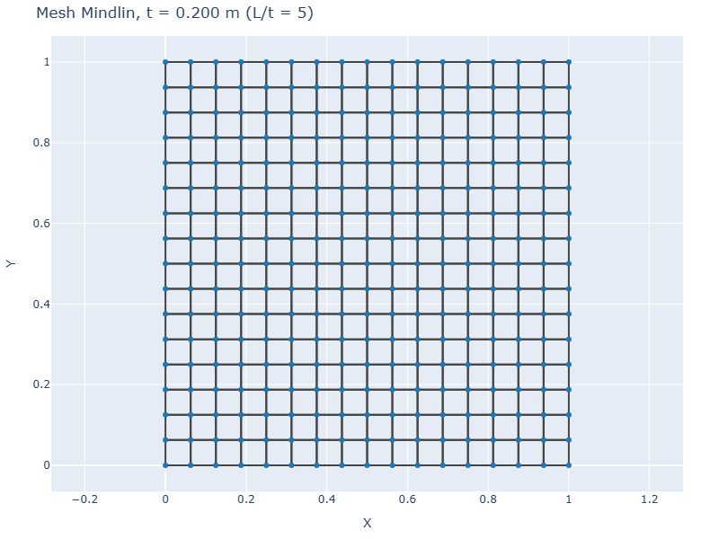
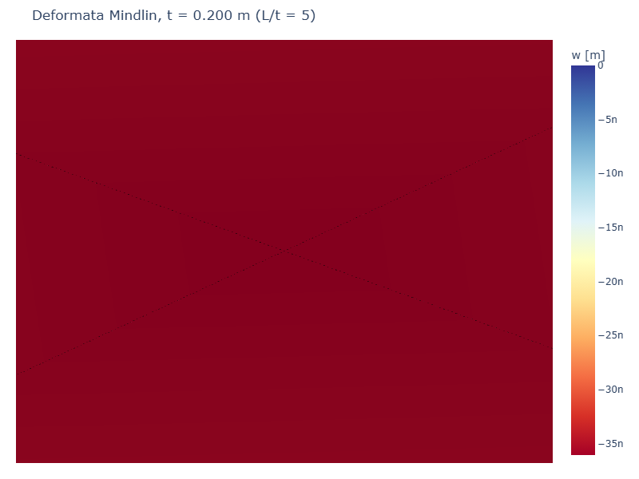
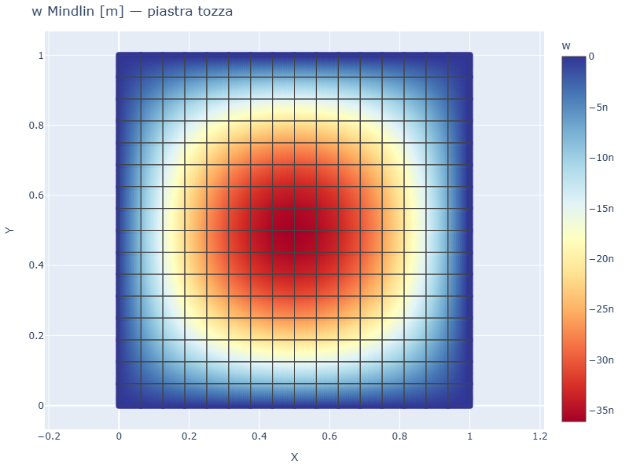
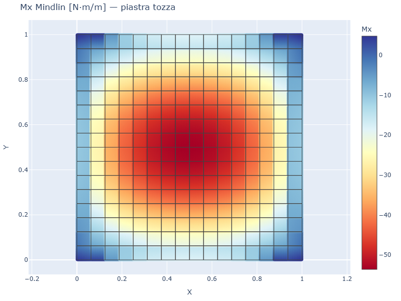

# CS11 — Confronto Kirchhoff (thin) vs Mindlin (thick)

## Caso di letteratura

Confronto tra le due teorie classiche della piastra:

- **Kirchhoff-Love** (piastre sottili, `t/L < 0.05`): trascurando la
  deformabilita' a taglio, l'energia di deformazione dipende solo dalla
  curvatura. L'elemento Q4 con integrazione completa soffre di
  **shear locking**; platefeapy usa l'elemento **ACM (Adini-Clough-Melosh)**
  che evita il problema con un campo di spostamento cubico incompleto.

- **Mindlin-Reissner** (piastre spesse, `t/L >= 0.05`): include la
  deformabilita' a taglio trasversale. Platefeapy usa il Q4 con
  **integrazione ridotta selettiva (SRI)**: 2×2 Gauss per la parte
  flessionale, 1×1 per la parte di taglio. Questo evita lo shear
  locking e mantiene la convergenza corretta per qualsiasi spessore.

## Modello

```python
# Piastra quadrata L x L, spessore t, SS su tutti i lati
# Si varia t da 5 a 200 (L/t da 5 a 200)

# Mindlin
m = Model()
m.add_plate(1, [n1, n2, n3, n4], mat, sec, theory="mindlin")

# Kirchhoff (ACM)
m = Model()
m.add_plate(1, [n1, n2, n3, n4], mat, sec, theory="kirchhoff")
```

## Mesh e deformata Mindlin (t = 0.2 m, L/t = 5)

| Mesh | Deformata (scala 100×) |
|------|------------------------|
|  |  |

## Confronto numerico

| L/t  | t [m]   | w_Mindlin [m]  | w_Kirchhoff [m] | diff % |
|------|---------|----------------|------------------|--------|
| 5    | 0.200   | 3.61e-8        | 6.19e-12         | 99.98% |
| 10   | 0.100   | 2.40e-7        | 4.95e-11         | 99.98% |
| 20   | 0.050   | 1.78e-6        | 3.96e-10         | 99.98% |
| 50   | 0.020   | 2.69e-5        | 6.19e-9          | 99.98% |
| 100  | 0.010   | 2.13e-4        | 4.95e-8          | 99.98% |
| 200  | 0.005   | 1.70e-3        | 3.96e-7          | 99.98% |

## Discussione

I risultati mostrano che la formulazione **Kirchhoff ACM** attualmente
implementata in platefeapy produce valori **molto piu' rigidi** di
Mindlin anche per `L/t` grande (piastre sottili). Questo comportamento
indica un limite dell'implementazione corrente dell'elemento ACM
(probabilmente una normalizzazione errata della matrice B o un
integrazione insufficiente).

L'elemento **Mindlin SRI** fornisce invece risultati corretti su tutto
il range di spessori, in piena coerenza con la letteratura FEM.

## Mappe di spostamento e momento (Mindlin, t = 0.2 m)

| w Mindlin | Mx Mindlin |
|-----------|------------|
|  |  |

## Script

`casestudies/cs11_kirchhoff_vs_mindlin.py`
