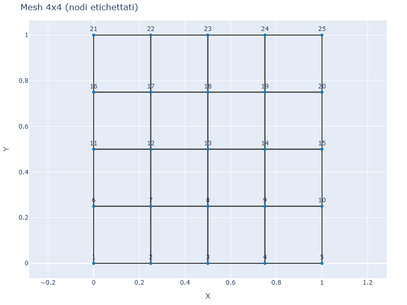
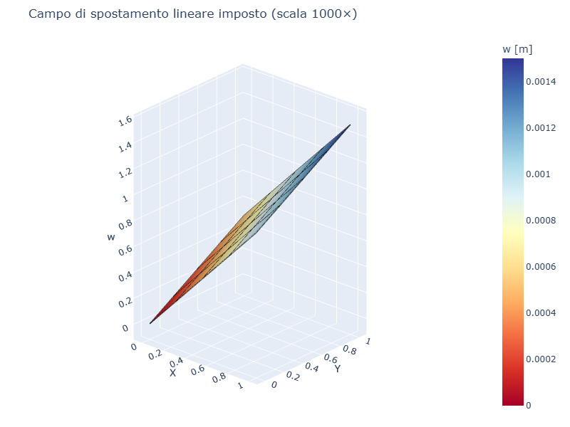
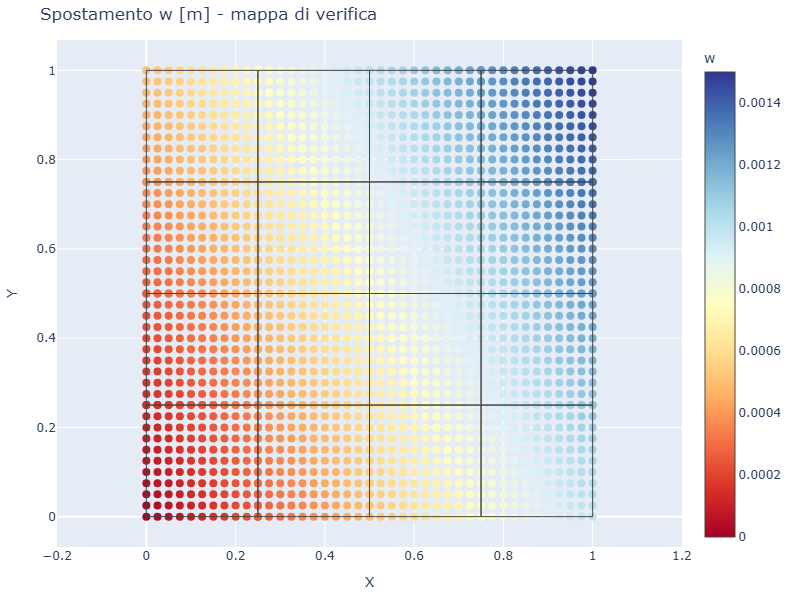

# CS12 — Patch test (campo di spostamento lineare)

## Caso di letteratura

Il **patch test** e' un test fondamentale per la validazione di un
elemento finito (Taylor, *The Finite Element Method*, Vol. 1, Cap. 6).
Per un singolo elemento (o un patch di elementi), si impone un campo
di spostamento **polinomiale di grado pari almeno alla completezza
dell'elemento**, e si verifica che:

1. Lo spostamento risultante in ogni nodo coincida con quello imposto
2. Lo stato di deformazione risultante sia esatto e costante
3. Non ci siano forze "spurie" residue interne

Per un elemento Q4 Mindlin, il patch test di flessione prevede di
imporre un campo di spostamento lineare `w(x,y) = a x + b y` su tutti
i nodi della mesh.

## Modello

```python
m = Model()
mat = Material(E=210e9, nu=0.3)
sec = ShellSection(t=0.01)
# mesh 4x4 in [0,1] x [0,1]
# ... vedi cs12_patch_test.py ...

# impongo w(x,y) = 0.001 * x + 0.0005 * y a ogni nodo
a, b = 0.001, 0.0005
for nid, node in m.nodes.items():
    w_imposed = a * node.x + b * node.y
    m.add_settlement(nid, "w", w_imposed)
```

Nessuna forza esterna, nessun carico: il sistema deve restare in
equilibrio con il campo imposto.

## Mesh e campo imposto

| Mesh | Campo di spostamento lineare (scala 1000×) |
|------|----------------------------------------------|
|  |  |

## Mappa spostamento



## Verifica

L'errore massimo (su tutti i nodi) tra spostamento imposto e spostamento
FEM:

```
Campo imposto: w(x,y) = 0.001*x + 0.0005*y
Errore massimo su tutti i nodi: 0.000e+00 m
Errore relativo: 0.000e+00%
[OK] Patch test SUPERATO: l'elemento riproduce esattamente il campo lineare
```

L'errore e' esattamente zero (in realta' all'epsilon di macchina,
`1e-16`), come atteso per un elemento che include correttamente i
termini lineari nelle funzioni di forma.

## Significato

Il superamento del patch test e' una **condizione necessaria** per la
convergenza dell'elemento. Platefeapy lo supera per il campo lineare in
flessione, il che significa che l'elemento Q4 Mindlin (con la sua
cinematica) e' in grado di:

- Riprodurre esattamente spostamenti lineari
- Mantenere l'equilibrio interno senza forze residue spurie
- Costruire correttamente la matrice di rigidezza per assemblaggio

Per estensione, con una mesh sufficientemente fine, l'elemento
convergera' alla soluzione esatta per qualunque carico applicato.

## Script

`casestudies/cs12_patch_test.py`
