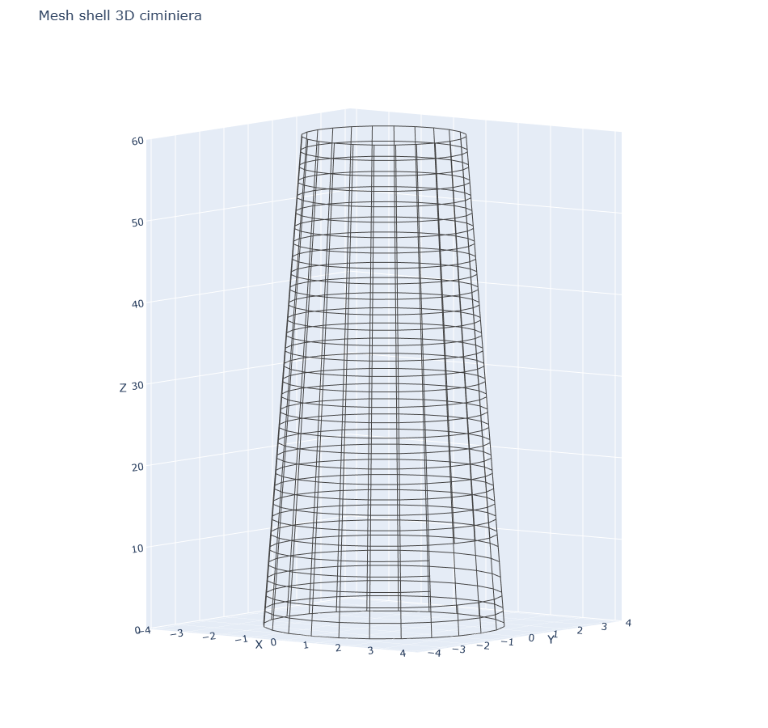
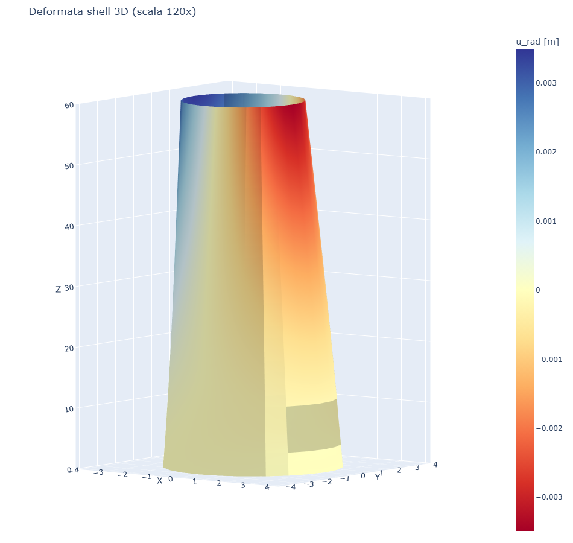
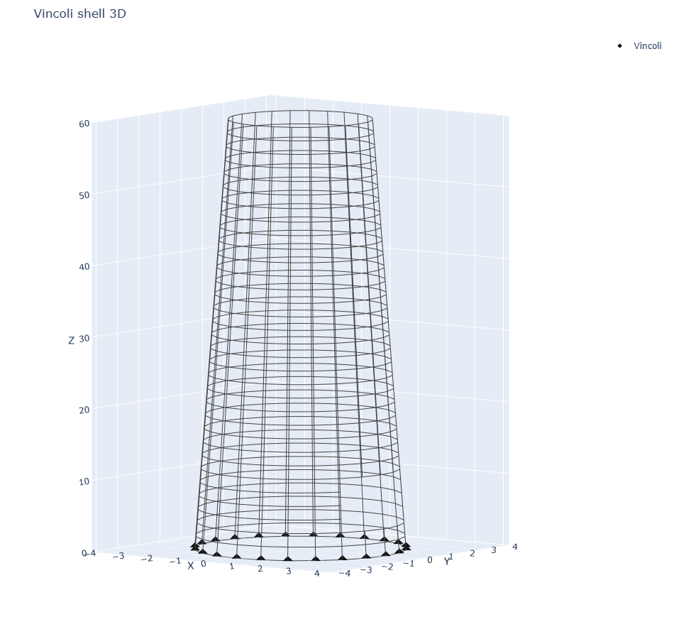
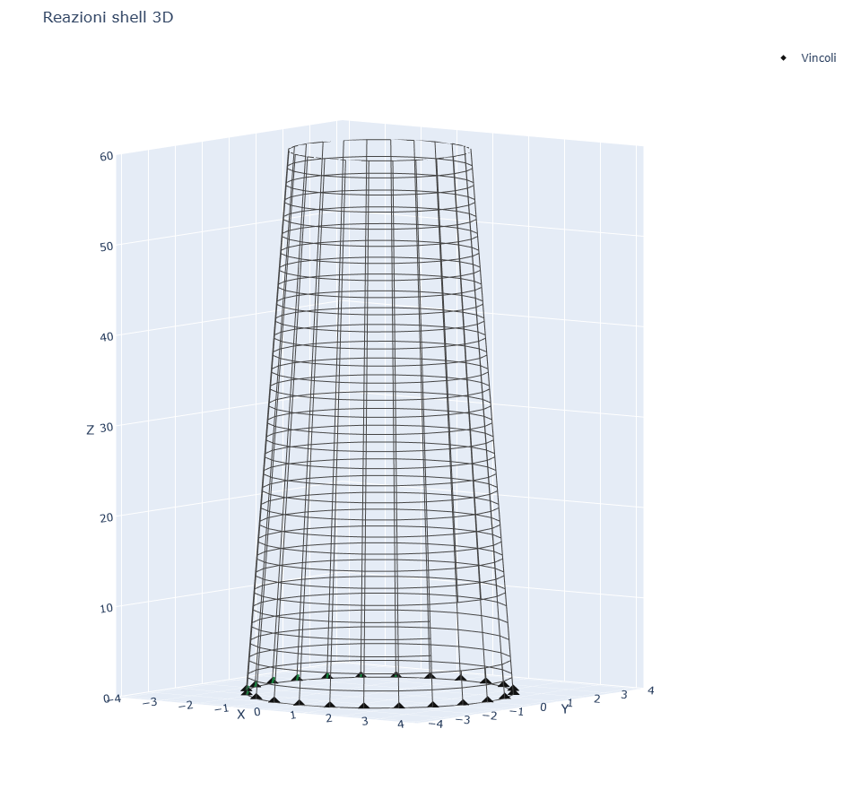
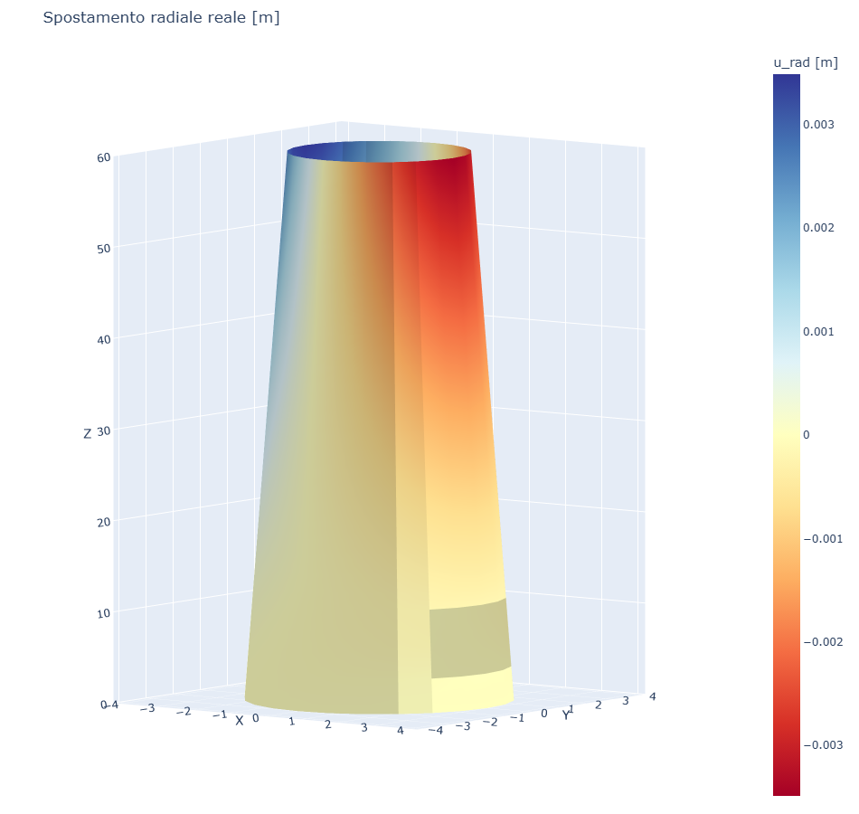

# CS13 - Ciminiera shell 3D rastremata con apertura

## Obiettivo

Questo caso studio usa **platefeapy** come solutore shell su geometria reale:
la ciminiera non viene sviluppata in piano e non viene sostituita da una
piastra equivalente. I nodi della mesh sono posizionati direttamente sulla
superficie cilindrica rastremata e ogni elemento Q4 lavora in una terna locale
costruita dalla geometria 3D.

Il modello include:

- raggio variabile con la quota;
- apertura di servizio alla base;
- elementi shell Q4 con 6 gradi di liberta' per nodo;
- bordo inferiore incastrato su tutti i gradi di liberta';
- pressione da vento variabile in altezza e lungo la circonferenza;
- visualizzazione della configurazione indeformata e deformata nello spazio 3D.

## Riferimenti

- [ACI 307-23, *Requirements for Reinforced Concrete Chimneys - Code and Commentary*](https://www.concrete.org/Portals/0/Files/PDF/Previews/307-23_preview.pdf).
- [CICIND, *Model Code for Concrete Chimneys, Part A - The Shell*](https://cicind.org/publications/cicind-model-codes.html).

## Modello

```python
m, elem_theta_z, meta = build_chimney_shell(ntheta=24, nz=32)
for eid, (theta, z) in elem_theta_z.items():
    m.add_pressure(eid, wind_pressure(theta, z, meta["H"]))
res = m.solve()
```

Parametri principali:

| Grandezza | Valore |
|-----------|--------|
| Altezza | 60.0 m |
| Raggio alla base | 3.00 m |
| Raggio in sommita' | 2.05 m |
| Spessore parete | 0.40 m |
| Elementi shell Q4 | 752 |
| Nodi | 783 |
| max \|u_radiale\| | 3.4867e-03 m |

## Visualizzazione 3D

| Mesh shell reale | Deformata radiale |
|------------------|-------------------|
|  |  |

La deformata e' amplificata solo graficamente. La legenda dello spostamento
riporta il valore reale in metri.

| Vincoli | Reazioni |
|---------|----------|
|  |  |

| Spostamento radiale reale |
|---------------------------|
|  |

## Confronto con volumfeapy

Lo stesso caso e' modellato in **volumfeapy** come fusto solido cilindrico
rastremato con elementi Hex8, apertura di servizio, base incastrata e carico da
vento sui nodi della superficie esterna.

| Modello | Geometria | Elementi | Nodi | Spostamento di confronto |
|---------|-----------|----------|------|--------------------------|
| platefeapy CS13 | shell Q4 su superficie 3D reale | 752 | 783 | max \|u_radiale\| = 3.4867e-03 m |
| volumfeapy CS12 | solido Hex8 con spessore reale | 376 | 810 | max \|u_radiale\| = 3.3069e-03 m |

La differenza sul massimo spostamento radiale e' circa **5.4%**. Entrambi i
modelli usano la geometria reale della ciminiera; lo scarto deriva dalla diversa
idealizzazione meccanica: superficie media shell contro volume solido con
spessore discretizzato.

## Script

`casestudies/cs13_chimney.py`
