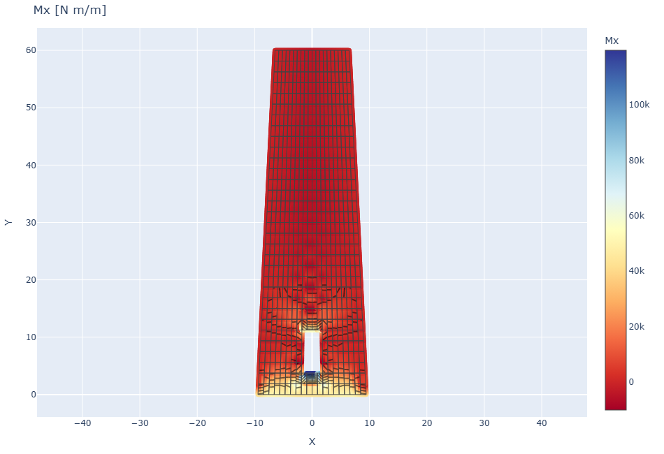
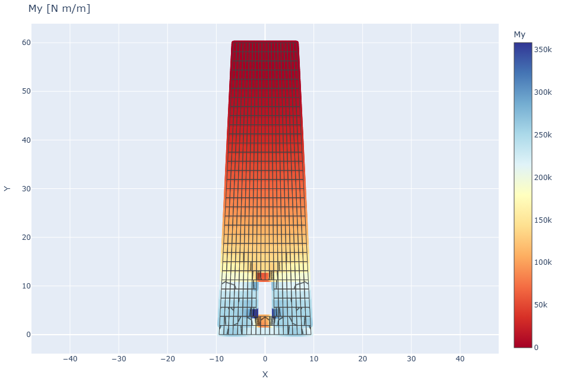

# CS13 - Ciminiera rastremata con apertura

## Obiettivo

Questo caso studio mostra una mesh Q4 generica, non rettangolare, applicata
allo sviluppo piano equivalente della parete di una ciminiera cilindrica
rastremata. Il dominio include:

- larghezza circonferenziale variabile con la quota;
- apertura di servizio alla base;
- bordo inferiore incastrato;
- pressione da vento variabile in altezza e lungo la circonferenza.

Il caso e' pensato come esempio di mesh irregolare e visualizzazione. Non
sostituisce un modello shell cilindrico completo, perche' lo sviluppo piano non
include tutta la rigidezza geometrica della curvatura.

## Riferimenti

L'impostazione del problema richiama i criteri di progetto e modellazione per
ciminiere in cemento armato trattati in:

- [ACI 307-23, *Requirements for Reinforced Concrete Chimneys - Code and Commentary*](https://www.concrete.org/Portals/0/Files/PDF/Previews/307-23_preview.pdf).
- [CICIND, *Model Code for Concrete Chimneys, Part A - The Shell*](https://cicind.org/publications/cicind-model-codes.html).

## Modello

```python
m, elem_theta_z, meta = build_chimney_wall(nx=20, nz=32)
for eid, (theta, z) in elem_theta_z.items():
    m.add_pressure(eid, wind_pressure(theta, z, meta["H"]))
res = m.solve()
```

Parametri principali:

| Grandezza | Valore |
|-----------|--------|
| Altezza | 60.0 m |
| Raggio alla base | 3.00 m |
| Raggio in sommita' | 2.05 m |
| Spessore parete | 0.40 m |
| Elementi Q4 | 624 |
| Nodi | 684 |
| max \|w\| | 1.6183 m |

## Visualizzazione

| Mesh | Deformata |
|------|-----------|
|  |  |

| Vincoli | Reazioni |
|---------|----------|
|  |  |

| Spostamento w | Momento Mx |
|---------------|------------|
|  |  |

| Momento My |
|------------|
|  |

## Note

Il controllo di equilibrio globale sui carichi trasversali risulta nullo entro
la precisione numerica del modello. La deformata viene amplificata di `10x` per
rendere leggibile la forma; la legenda dello spostamento riporta i valori reali.

## Script

`casestudies/cs13_chimney.py`
