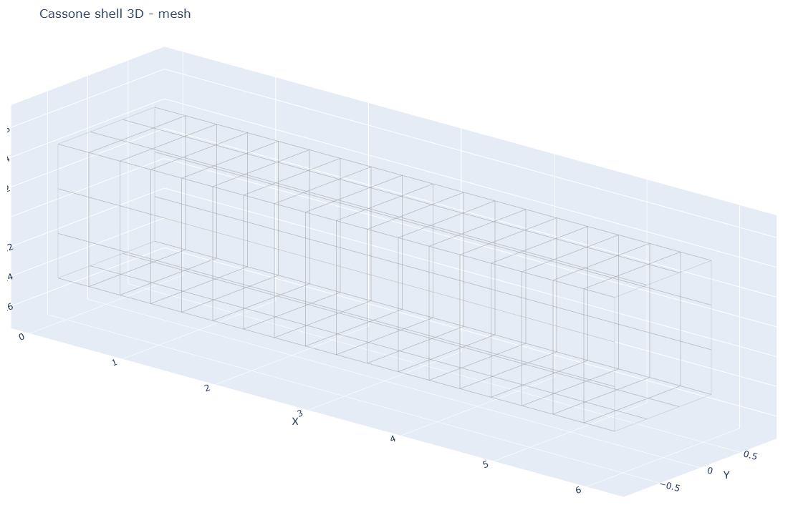
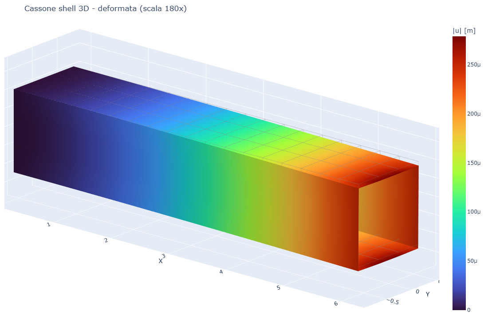
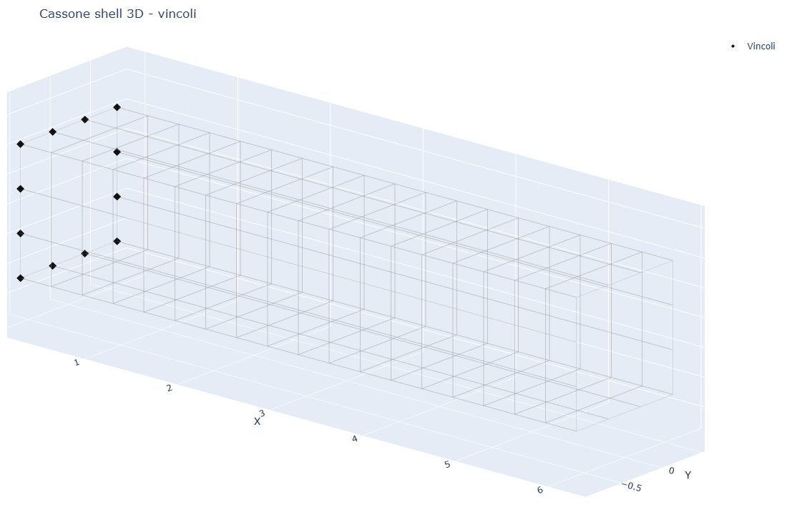
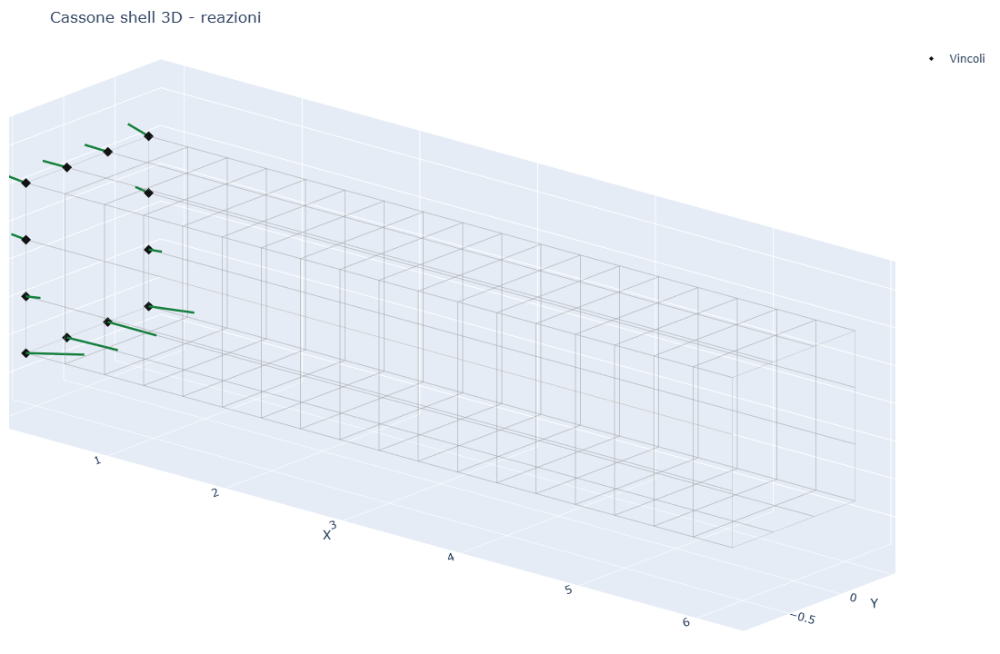

# CS14 - Cassone sottile shell 3D a mensola

## Obiettivo

Questo caso studio modella una trave cassone rettangolare sottile con elementi
shell Q4 su geometria 3D reale. Il modello rappresenta le quattro pareti del
cassone: soletta superiore, soletta inferiore e due anime laterali.

Il caso serve come confronto diretto con **volumfeapy CS13**, dove lo stesso
cassone e' modellato con elementi solidi Hex8 e spessore reale.

## Modello

```python
m, meta = build_box_girder_shell(nx=18, n_per_wall=3)
res = m.solve()
```

| Grandezza | Valore |
|-----------|--------|
| Lunghezza | 6.00 m |
| Larghezza | 1.20 m |
| Altezza | 0.90 m |
| Spessore | 0.060 m |
| Elementi shell Q4 | 216 |
| Nodi | 228 |
| Carico in punta | -25.0 kN |
| w medio in punta | -2.5958e-04 m |

## Visualizzazione

| Mesh shell | Deformata |
|------------|-----------|
|  |  |

La deformata e' amplificata solo graficamente. La legenda riporta il valore
reale di `|u|` in metri; il modello indeformato e' mostrato come wireframe
trasparente di riferimento.

| Vincoli | Reazioni |
|---------|----------|
|  |  |

## Confronto con volumfeapy

| Modello | Idealizzazione | Elementi | Nodi | w medio in punta |
|---------|----------------|----------|------|------------------|
| platefeapy CS14 | shell Q4 su superficie media | 216 | 228 | -2.5958e-04 m |
| volumfeapy CS13 | pareti Hex8 con spessore reale | 216 | 532 | -2.9368e-04 m |

Lo scarto e' circa **11.6%**. La differenza e' coerente con il confronto tra
un modello shell di superficie media e un modello solido con spessore
discretizzato.

## Script

`casestudies/cs14_box_girder.py`
