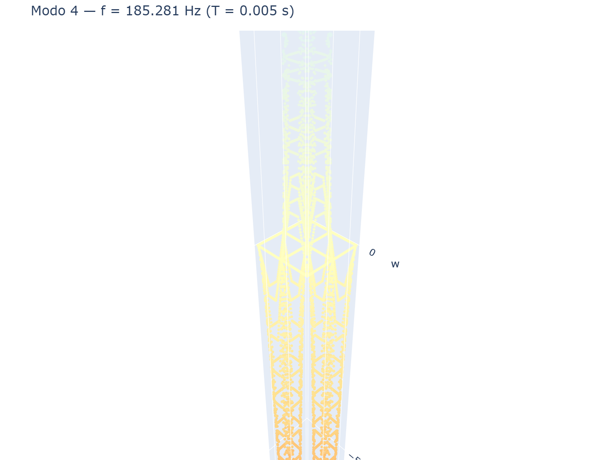

# 10 - Modal Analysis

## Natural frequencies and mode shapes

```python
mr = m.modal(n_modes=6)

for i in range(len(mr.freq)):
    print(f"Mode {i+1}: f = {mr.freq[i]:.3f} Hz, T = {mr.period[i]:.3f} s")
```

`modal()` solves the eigenvalue problem `K φ = ω² M φ` on free DOFs.

## Mass matrix

The mass matrix is **lumped** (diagonal) and computed from element density:

```python
M = m.assemble_mass()    # diagonal mass vector (ndof,)
```

Mass per node:

```
m_node = ρ · t · A_element / 4
```

Rotational inertia (about X and Y):

```
I_rot = m_node · t² / 12
```

## Result object

```python
mr = m.modal(n_modes=10)

mr.omega          # angular frequencies [rad/s]
mr.freq           # natural frequencies [Hz]
mr.period         # periods [s]
mr.phi            # mode shapes (ndof × n_modes)

# Single mode
mr.mode(i)                    # mode shape vector (ndof,)
mr.mode_shape(i, node)        # [w, theta_x, theta_y] at node
```

## Visualization

```python
from platefeapy.plotting import plot_mode

# First mode
plot_mode(mr, i=0, scale=100).show()

# Loop through modes
for i in range(min(6, len(mr.freq))):
    plot_mode(mr, i=i, scale=100).show()
```

### Mode shapes

The following images show the first four vibration modes of a simply supported
square plate:

#### Mode 1 — Fundamental (1,1)


*First mode shape: single half-wave in both directions.*

#### Mode 2 — (1,2) or (2,1)


*Second mode shape: two half-waves in one direction.*

#### Mode 3 — Higher harmonic


*Third mode shape.*

#### Mode 4 — (2,2)


*Fourth mode shape: two half-waves in both directions.*

## Analytical comparison

For a simply supported rectangular plate (a × b), the Navier solution gives:

```
f_mn = (π / (2·a²)) · √(D / (ρ·t)) · (m² + (a/b)²·n²)
```

where `m, n = 1, 2, 3, ...` are the mode numbers.

### Example: square plate

```python
import numpy as np

L = 1.0
E = 210e9
nu = 0.3
t = 0.01
rho = 7850.0

D = E * t**3 / (12 * (1 - nu**2))
mass_per_area = rho * t

# First mode (m=1, n=1)
f_11 = (np.pi / (2 * L**2)) * np.sqrt(D / mass_per_area) * (1**2 + 1**2)
print(f"f_11 analytical = {f_11:.3f} Hz")

# Compare with FEM
mr = m.modal(n_modes=1)
print(f"f_11 FEM        = {mr.freq[0]:.3f} Hz")
```

## Mode shape interpretation

| Mode | Simply supported | Clamped |
|------|-----------------|---------|
| 1 | Single half-wave (1,1) | Single dome |
| 2 | Two half-waves (1,2) or (2,1) | Asymmetric |
| 3 | Higher harmonic | Complex pattern |

## Requirements

- Material must have `rho > 0` (density)
- Sufficient constraints to prevent rigid body modes
- Free DOFs without mass are eliminated by static condensation

If `rho = 0`, `modal()` raises:
```
ValueError: Massa nulla: impostare rho nel materiale.
```
