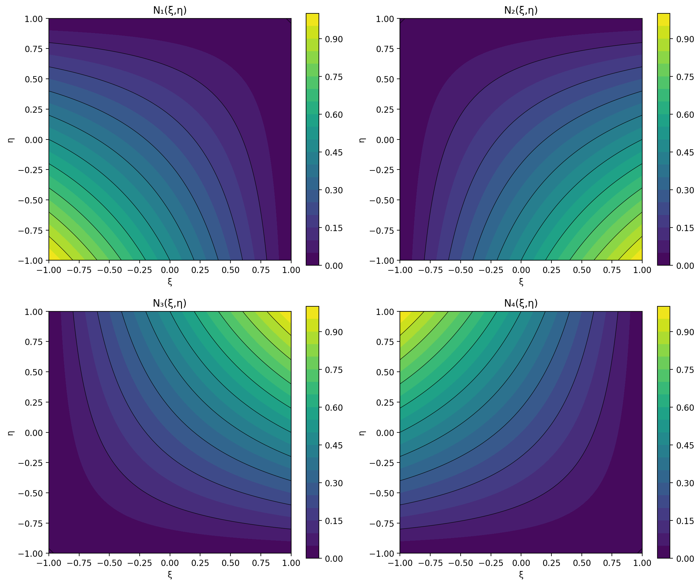

# 16 - Shape Functions

Shape functions are the mathematical foundation of the finite element method. They interpolate the displacement field within an element from the nodal values.

## Q4 Element (Quadrilateral 4-node)

The Q4 element uses **bilinear shape functions** defined in natural coordinates (ξ, η) ∈ [-1, 1]².

### Shape Function Definitions

For a quadrilateral element with nodes numbered counter-clockwise:

```
N₁(ξ,η) = ¼(1-ξ)(1-η)
N₂(ξ,η) = ¼(1+ξ)(1-η)
N₃(ξ,η) = ¼(1+ξ)(1+η)
N₄(ξ,η) = ¼(1-ξ)(1+η)
```

### Properties

1. **Partition of unity**: N₁ + N₂ + N₃ + N₄ = 1 everywhere
2. **Kronecker delta**: Nᵢ(ξⱼ, ηⱼ) = δᵢⱼ (1 at node i, 0 at other nodes)
3. **Linear along edges**: varies linearly along each element edge
4. **Bilinear inside**: product of linear functions in ξ and η

### Visualization


*Contour plots of the four bilinear shape functions in natural coordinates.*

### Displacement Interpolation

The transverse displacement w at any point (ξ, η) is:

```
w(ξ,η) = N₁·w₁ + N₂·w₂ + N₃·w₃ + N₄·w₄
```

Similarly for rotations θₓ and θᵧ.

### Derivatives

The derivatives with respect to natural coordinates are:

```
∂N₁/∂ξ = -¼(1-η)    ∂N₁/∂η = -¼(1-ξ)
∂N₂/∂ξ = +¼(1-η)    ∂N₂/∂η = -¼(1-ξ)
∂N₃/∂ξ = +¼(1+η)    ∂N₃/∂η = +¼(1-ξ)
∂N₄/∂ξ = -¼(1+η)    ∂N₄/∂η = +¼(1-ξ)
```

These are used to compute the strain-displacement matrix B.

## Coordinate Mapping

The same shape functions map from natural coordinates (ξ, η) to physical coordinates (x, y):

```
x(ξ,η) = N₁·x₁ + N₂·x₂ + N₃·x₃ + N₄·x₄
y(ξ,η) = N₁·y₁ + N₂·y₂ + N₃·y₃ + N₄·y₄
```

### Jacobian Matrix

The Jacobian matrix J relates derivatives in natural and physical coordinates:

```
J = [∂x/∂ξ  ∂y/∂ξ] = Σᵢ [∂Nᵢ/∂ξ · xᵢ   ∂Nᵢ/∂ξ · yᵢ]
    [∂x/∂η  ∂y/∂η]     [∂Nᵢ/∂η · xᵢ   ∂Nᵢ/∂η · yᵢ]
```

The determinant |J| must be positive everywhere for a valid element.

## Integration

Numerical integration uses **Gauss quadrature** in natural coordinates:

```
∫∫ f(ξ,η) dξ dη ≈ Σᵢ Σⱼ wᵢ·wⱼ·f(ξᵢ, ηⱼ)
```

### Integration Schemes

| Scheme | Points | Accuracy | Use |
|--------|--------|----------|-----|
| 1×1 | 1 | Linear | Shear (reduced) |
| 2×2 | 4 | Cubic | Bending (full) |
| 3×3 | 9 | Quintic | Higher order |

### Selective Reduced Integration (SRI)

The Mindlin plate element uses:
- **2×2 Gauss** for bending stiffness (full integration)
- **1×1 Gauss** for shear stiffness (reduced integration)

This prevents shear locking in thin plates while maintaining accuracy.

## Implementation

In platefeapy, shape functions are implemented in the `MindlinPlateQ4` class:

```python
def _shape_functions(self, xi, eta):
    """Bilinear shape functions N1..N4."""
    return np.array([
        0.25 * (1 - xi) * (1 - eta),
        0.25 * (1 + xi) * (1 - eta),
        0.25 * (1 + xi) * (1 + eta),
        0.25 * (1 - xi) * (1 + eta),
    ])
```

The B-matrix (strain-displacement) is computed using the shape function derivatives and the Jacobian inverse.

## References

- Zienkiewicz, O.C., Taylor, R.L. (2000). *The Finite Element Method*, Vol. 1. Butterworth-Heinemann.
- Hughes, T.J.R. (1987). *The Finite Element Method*. Prentice-Hall.
