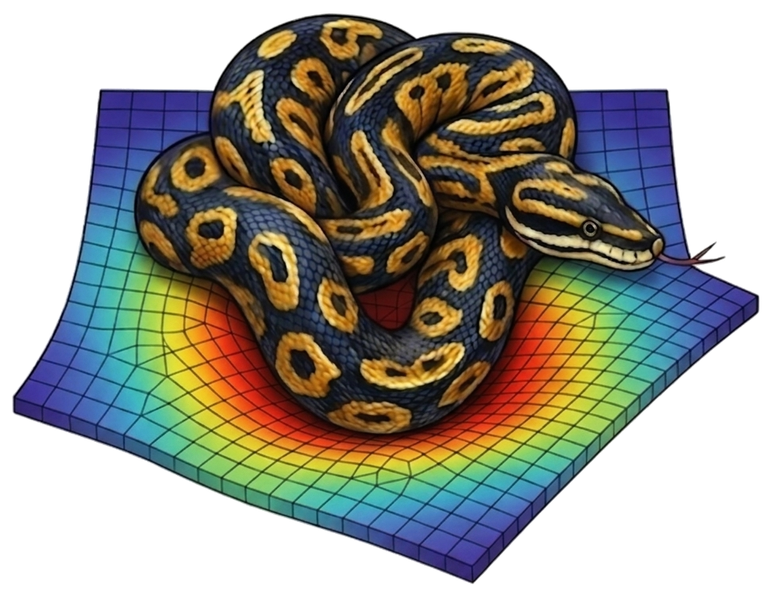

# platefeapy

<div align="center">
  
</div>

A Python finite-element solver for the **static and modal analysis** of
**plate structures** using Mindlin-Reissner and Kirchhoff-Love theory — pressure
loads, thermal gradients, settlements, modal analysis, Plotly visualization and
a Streamlit web UI.

---

## Documentation / Documentazione

The documentation is available in two languages with the same set of topics.
La documentazione è disponibile in due lingue con lo stesso insieme di argomenti.

| | |
|---|---|
| 🇬🇧 **[English documentation](en.md)** | Full guide: installation, modeling, element types, loads, analyses, post-processing and Web UI. |
| 🇮🇹 **[Documentazione in italiano](it.md)** | Guida completa: installazione, modellazione, tipi di elemento, carichi, analisi, post-processing e interfaccia web. |

Use the **language sections in the sidebar** (English / Italiano) to browse all
chapters. Use la **barra laterale** per sfogliare tutti i capitoli.

---

## Quick start

```bash
pip install "platefeapy[all]"
```

```python
from platefeapy import Model, Material, ShellSection

m = Model()
m.add_node(1, 0, 0); m.add_node(2, 1, 0)
m.add_node(3, 1, 1); m.add_node(4, 0, 1)

mat = Material(E=210e9, nu=0.3)
sec = ShellSection(t=0.01)
m.add_plate(1, [1, 2, 3, 4], mat, sec)

for nid in range(1, 5):
    m.fix(nid, ["w"])

m.add_pressure(1, p=-1000.0)
res = m.solve()
print(res.displacements(1))
```

→ Continue with the [English Quick Start](en-02-quick-start.md) or the
[Quick Start in italiano](it-02-quick-start.md).

---

## Key features

- **Mindlin-Reissner plate** (thick plates, shear deformable, SRI integration)
- **Kirchhoff-Love plate** (thin plates, ACM element)
- **Loads**: pressure (uniform, patch), nodal, thermal gradient, settlements
- **Modal analysis** (natural frequencies, mode shapes)
- **Post-processing**: bending moments (Mx, My, Mxy), shear forces (Qx, Qy), principal moments
- **Plotly** 2D/3D plots and a **Streamlit web UI** (`app.py`)

## License

MIT — see `LICENSE`. Built by Domenico Gaudioso.
