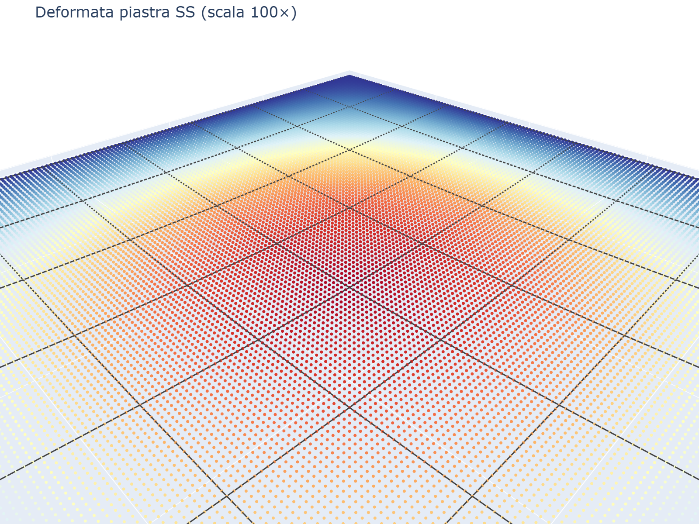
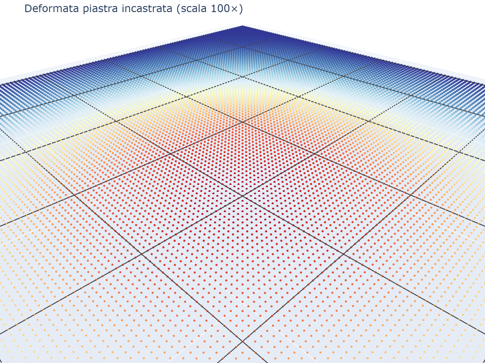
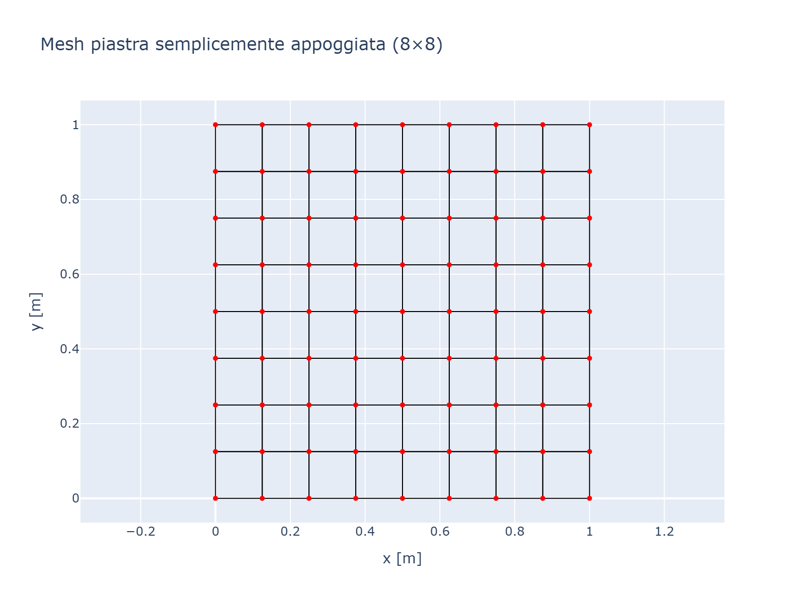
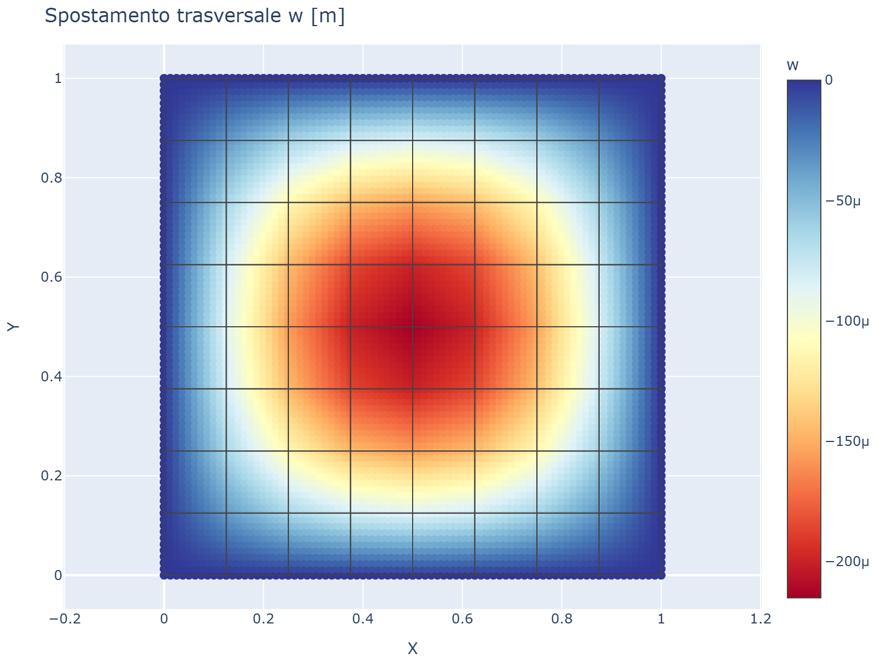
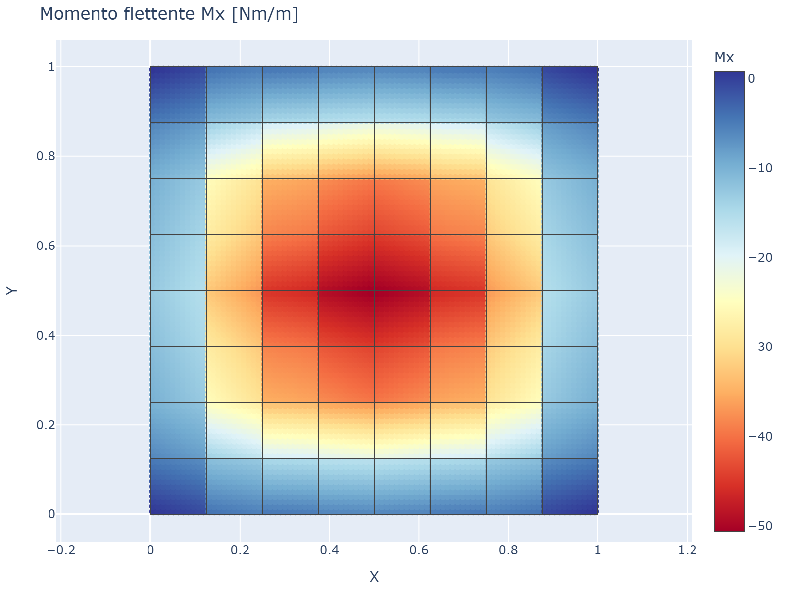
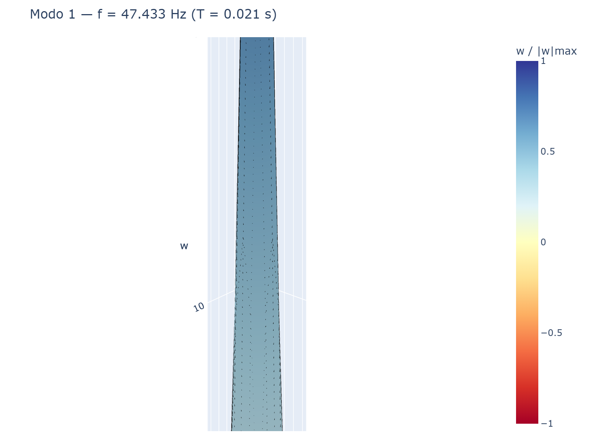
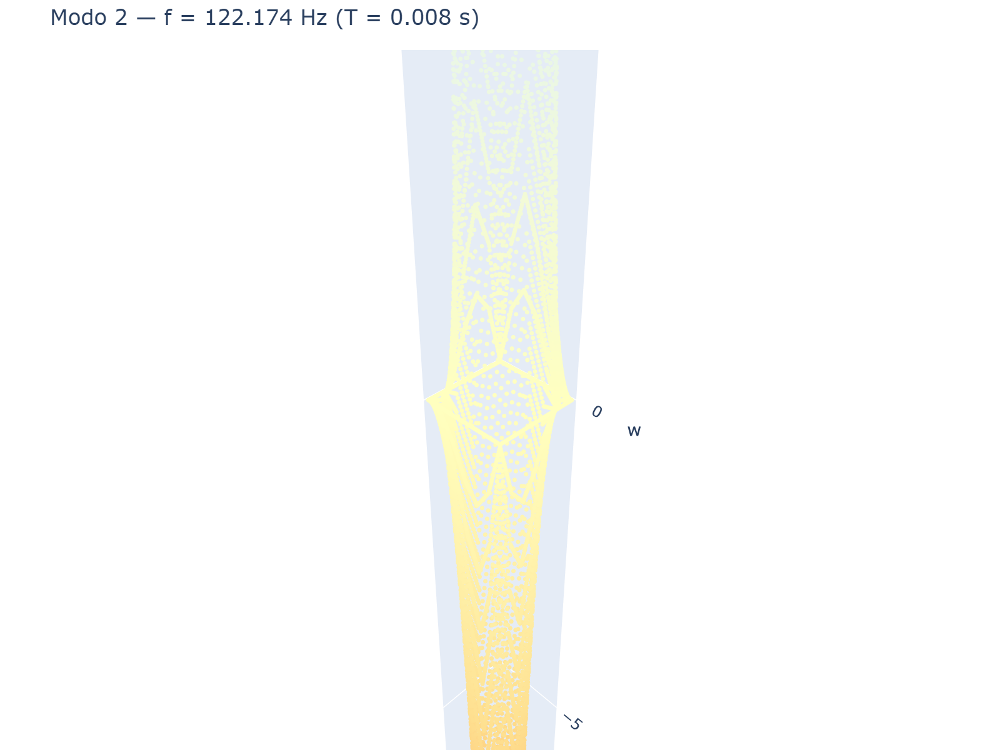
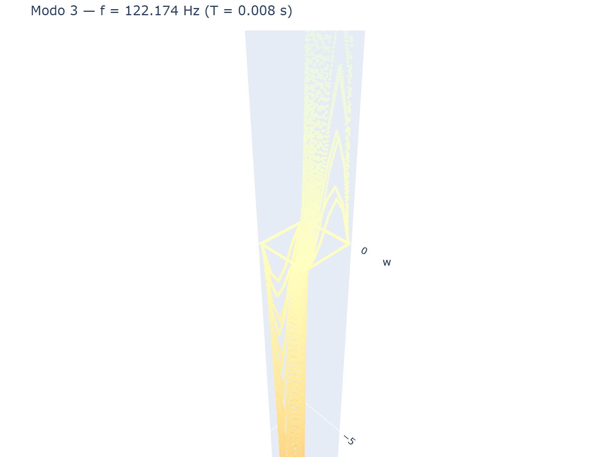

# platefeapy

Python finite-element solver for static and modal analysis of plate structures.
It focuses on readable engineering workflows: model definition in Python,
Mindlin-Reissner and Kirchhoff-Love plate elements, pressure and thermal loads,
modal analysis, Plotly post-processing, and a Streamlit web UI.

[English documentation](en.md){: .btn .btn-primary }
[Documentazione in italiano](it.md){: .btn }
[GitHub repository](https://github.com/DomenicoGaudioso/platefeapy){: .btn }

## What You Can Inspect

The deformed shape plots show the undeformed model as a transparent reference
mesh and the displaced configuration as a colored surface. The plotted geometry
can be amplified with a deformation scale factor, while the colorbar always
reports the real transverse displacement `w` in meters. Modal shapes use a
normalized modal amplitude so the shape is comparable even when eigenvectors
are arbitrarily scaled.

| Simply supported plate | Clamped plate |
|---|---|
|  |  |

## Results Gallery

| Mesh | Displacement map | Bending moment |
|---|---|---|
|  |  |  |

| Mode 1 | Mode 2 | Mode 3 |
|---|---|---|
|  |  |  |

## Quick Start

```bash
pip install "platefeapy[all]"
```

```python
from platefeapy import Model, Material, ShellSection
from platefeapy.plotting import plot_deformed

m = Model()
m.add_node(1, 0, 0)
m.add_node(2, 1, 0)
m.add_node(3, 1, 1)
m.add_node(4, 0, 1)

mat = Material(E=210e9, nu=0.3)
sec = ShellSection(t=0.01)
m.add_plate(1, [1, 2, 3, 4], mat, sec)

for nid in range(1, 5):
    m.fix(nid, ["w"])

m.add_pressure(1, p=-1000.0)
res = m.solve()

deformation_scale = 100.0  # visual amplification only
fig = plot_deformed(res, scale=deformation_scale)
fig.show()
```

## Populated Examples

| Case | Script | What it demonstrates |
|---|---|---|
| Simply supported square plate | `examples/ex01_simply_supported.py` | Uniform pressure, support conditions on the boundary, displacement contour and deformed shape |
| Clamped square plate | `examples/ex02_clamped.py` | Fully restrained boundary, bending moments near supports, comparison with reference formulas |
| Point load plate | `examples/ex03_point_load.py` | Concentrated nodal load and local displacement response |
| Convergence study | `usage_examples/01_convergence_ss_plate.py` | Mesh refinement against a Navier analytical solution |
| Modal analysis | `usage_examples/03_modal_analysis.py` | Natural frequencies and normalized mode shapes |

## Literature Case Studies

A complete set of **12 classical FEM benchmark cases** has been
implemented and compared with analytical solutions (Navier, Timoshenko,
Levy, etc.). Each case study is documented in the documentation site
with model construction, deformed shape, stress contours, and numerical
verification.

[View all case studies →]({{ site.baseurl }}/casestudies/)

| # | Case | Reference |
|---|------|-----------|
| CS01 | Square SS plate under UDL — Navier | Timoshenko §3 |
| CS02 | Square clamped plate under UDL | Timoshenko §3 |
| CS03 | Levy plate (2 SS, 2 free) | Timoshenko Tab. 3 |
| CS04 | Circular plate (SS / clamped) | Timoshenko §3.4 |
| CS05 | Rectangular plate — aspect ratio | Timoshenko Tab. 2 |
| CS06 | Patch load on SS plate | Timoshenko Tab. 5 |
| CS07 | Cantilever plate | Timoshenko Tab. 30 |
| CS08 | Concentrated load on SS plate | Timoshenko Tab. 4 |
| CS09 | Thermal gradient through thickness | Curvature imposed |
| CS10 | Support settlement | Kinematic imposition |
| CS11 | Kirchhoff vs Mindlin (thin/thick) | — |
| CS12 | Patch test (linear field) | Exact by construction |

Use `scale` only to make the deformed geometry readable in the figure. The
reported displacements, hover values and color legend remain unscaled analysis
results.

## Main Capabilities

- Q4 plate modeling with Mindlin-Reissner thick-plate behavior.
- Kirchhoff-Love thin-plate option through ACM-style interpolation.
- Uniform and patch pressures, nodal actions, settlements, and thermal gradients.
- Static solver, reactions, displacement extraction, moments and shear resultants.
- Modal solver with natural frequencies and colored mode-shape visualization.
- Plotly figures and Streamlit app for interactive checks.

MIT License. Built by Domenico Gaudioso.
