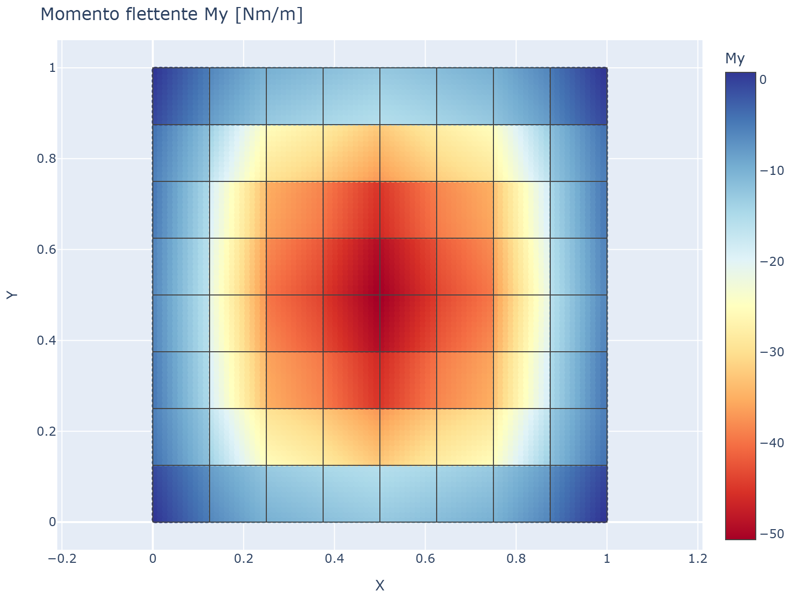
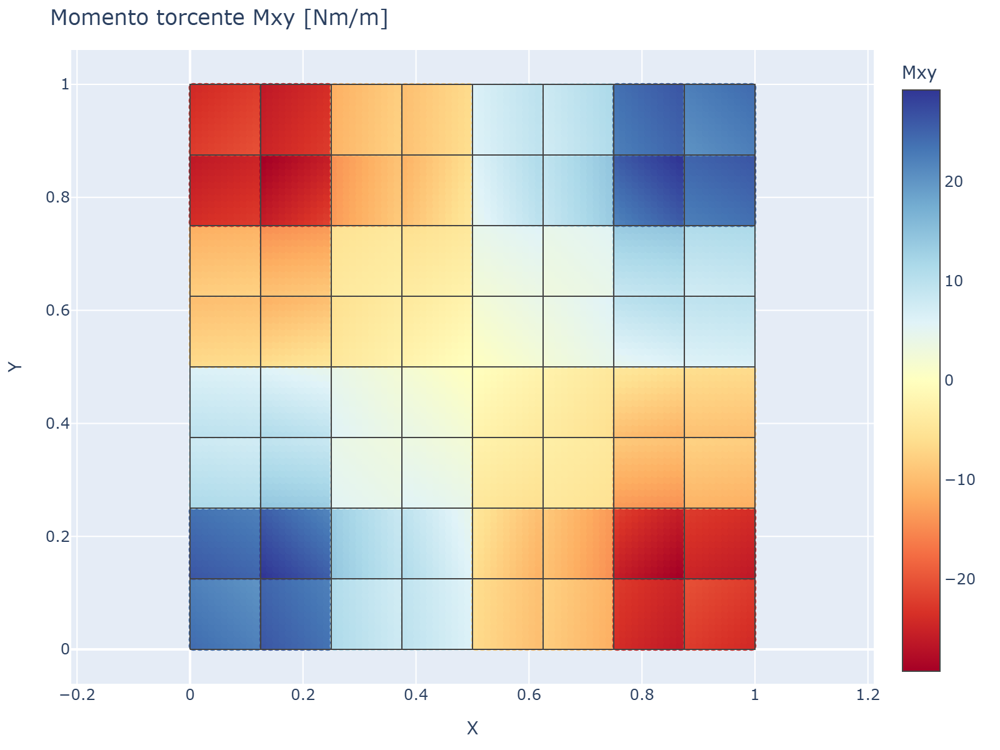
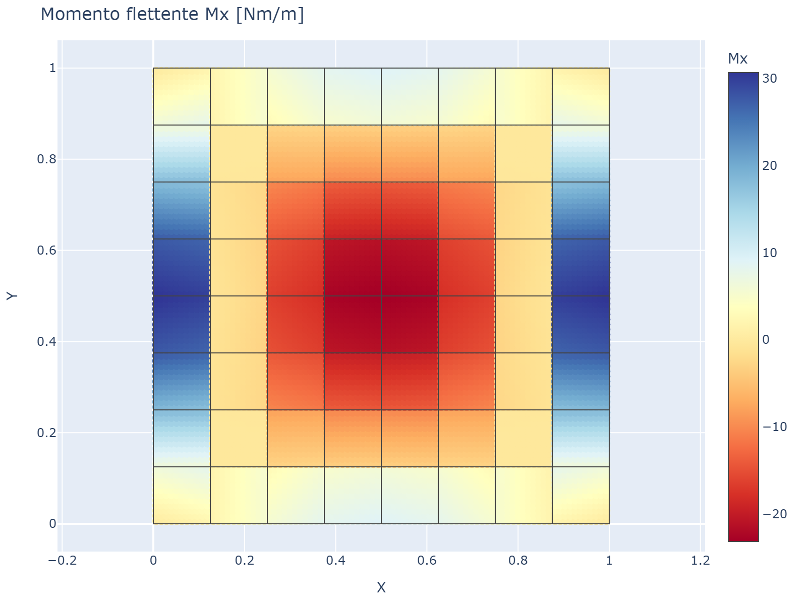

# 08 - Post-Processing

Dopo la soluzione (`res = m.solve()`), è possibile calcolare momenti flettenti,
forze di taglio e spostamenti in qualsiasi punto all'interno di ogni elemento.

## Risultati nodali

```python
res.displacements(nodo)           # array [w, theta_x, theta_y]
res.displacement(nodo, "w")       # singolo GdL (float)
res.reactions(nodo)               # array [Fz, Mx, My]
```

## Tensioni nell'elemento

```python
from platefeapy import postprocess

di = postprocess.element_stresses(res, elem_id, n=5)
# Restituisce dict: x, y, Mx, My, Mxy, Qx, Qy
```

Componenti:
- `Mx`: momento flettente attorno all'asse Y (causa curvatura in direzione X)
- `My`: momento flettente attorno all'asse X (causa curvatura in direzione Y)
- `Mxy`: momento torcente
- `Qx`: forza di taglio in direzione X
- `Qy`: forza di taglio in direzione Y

Le tensioni sono calcolate in `n×n` punti di Gauss all'interno dell'elemento.

## Spostamenti nell'elemento

```python
dd = postprocess.element_displacements(res, elem_id, n=11)
# Restituisce dict: x, y, w
```

Lo spostamento trasversale `w` è interpolato in `n×n` punti usando le funzioni
di forma dell'elemento.

## Forma deformata globale

```python
data = postprocess.deformed_shape(res, scale=100.0, n=11)
# Restituisce dict: {elem_id: {x, y, w}} per tutti gli elementi
```

## Momenti principali

```python
M1, M2, alpha = postprocess.principal_moments(Mx, My, Mxy)
```

Restituisce:
- `M1`: momento principale massimo
- `M2`: momento principale minimo
- `alpha`: angolo della direzione principale [radianti]

I momenti principali sono gli autovalori del tensore dei momenti:

```
[Mx   Mxy]
[Mxy  My ]
```

## Esempio completo

```python
res = m.solve()

# Freccia massima
w_max = max(abs(res.displacement(nid, "w")) for nid in m.nodes)
print(f"w_max = {w_max:.4e} m")

# Momenti al centro dell'elemento
s = postprocess.element_stresses(res, 1, n=1)
print(f"Mx = {s['Mx'][0]:.1f} Nm/m")
print(f"My = {s['My'][0]:.1f} Nm/m")
print(f"Mxy = {s['Mxy'][0]:.1f} Nm/m")

# Momenti principali
M1, M2, alpha = postprocess.principal_moments(s['Mx'][0], s['My'][0], s['Mxy'][0])
print(f"M1 = {M1:.1f} Nm/m a {alpha:.2f} rad")
print(f"M2 = {M2:.1f} Nm/m")

# Forze di taglio
print(f"Qx = {s['Qx'][0]:.1f} N/m")
print(f"Qy = {s['Qy'][0]:.1f} N/m")
```

## Recupero tensioni in punti arbitrari

```python
el = m.elements[eid]
ed = el.global_dofs(m.dof_map)
u_elem = res.U[ed]

# Tensioni alle coordinate naturali (xi, eta) in [-1, 1]
s = el.stress_at(xi=0.0, eta=0.0, u_elem=u_elem)
# Restituisce dict: Mx, My, Mxy, Qx, Qy
```

Coordinate naturali:
- `(0, 0)`: centro dell'elemento
- `(-1, -1)`: nodo 1
- `(1, -1)`: nodo 2
- `(1, 1)`: nodo 3
- `(-1, 1)`: nodo 4

## Esempi di visualizzazione

Le seguenti immagini mostrano risultati tipici di post-processing per una piastra
quadrata semplicemente appoggiata sotto pressione uniforme.

### Momento flettente Mx


*Mappa di contorno del momento flettente Mx [Nm/m].*

### Momento flettente My


*Mappa di contorno del momento flettente My [Nm/m].*

### Momento torcente Mxy


*Mappa di contorno del momento torcente Mxy [Nm/m].*

### Confronto piastra incastrata

Per confronto, ecco i risultati per una piastra incastrata (tutti i GdL fissati sul bordo):


*Forma deformata di una piastra incastrata (scala 100×).*


*Momento flettente Mx [Nm/m] per una piastra incastrata. Notare i momenti negativi ai bordi incastrati.*
